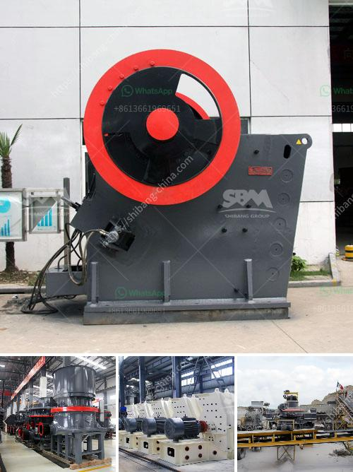

<h3>china processing plants for sale</h3>
China has long been recognized as a global manufacturing powerhouse, with its numerous processing plants catering to various industries. The country's extensive manufacturing infrastructure, combined with its skilled labor force and cost advantages, has made it an attractive destination for businesses looking to set up or expand their production capabilities.

In recent years, China has witnessed a surge in the number of processing plants available for sale. This trend can be attributed to a variety of factors, including changing market dynamics, industry consolidation, and technological advancements. With an increasing focus on sustainability and efficiency, many companies are looking to upgrade their facilities and align themselves with the latest technologies and practices. As a result, older processing plants are being replaced or put up for sale, providing an opportunity for potential buyers.

One significant advantage of acquiring a processing plant in China is the established supply chain ecosystem. The country boasts well-developed networks of raw material suppliers, logistics providers, and supporting industries, facilitating streamlined operations and cost efficiencies. By acquiring an existing plant, businesses can tap into this extensive network, minimizing the challenges associated with setting up a new facility from scratch.

Moreover, acquiring a processing plant in China can offer access to a vast consumer market. China is the world's most populous country, with a growing middle class that has a rising disposable income. This presents a significant opportunity for companies to penetrate and expand in the Chinese market, tapping into the demand for a wide range of products and services.

However, potential buyers should consider several factors before finalizing a purchase. It is crucial to conduct thorough due diligence and assess the condition of the plant, including its infrastructure, machinery, and compliance with environmental regulations. Engaging professional consultants or experts familiar with the Chinese market can aid in this process, ensuring a smooth transition and mitigating potential risks.

In conclusion, China's processing plants for sale offer an attractive opportunity for businesses looking to enter or expand in the competitive manufacturing industry. With its well-established supply chain, large consumer base, and cost advantages, China remains a top choice for companies seeking to enhance their production capabilities. By acquiring existing processing plants, businesses can leverage the country's manufacturing expertise and position themselves strategically in the global market.
<h3>Contact us</h3><ul><li><strong>Whatsapp:&nbsp;<a href="https://wa.me/8613661969651">+8613661969651</a></strong></li><li><a href="https://swt.shibang-china.com/?git&amp;zhl&amp;china processing plants for sale"><strong>Online Service(chat now)</strong></a></li></ul><h3>Related</h3><ul><li><a href='7 in x 8 in hammer mill gold quarz.md'>7 in x 8 in hammer mill gold quarz</a></li><li><a href='ecotec line for grinding of calcium carbonate.md'>ecotec line for grinding of calcium carbonate</a></li><li><a href='crush granite to powder.md'>crush granite to powder</a></li><li><a href='ballast crusher kenya.md'>ballast crusher kenya</a></li><li><a href='list of sponge iron factories in hospet.md'>list of sponge iron factories in hospet</a></li></ul>