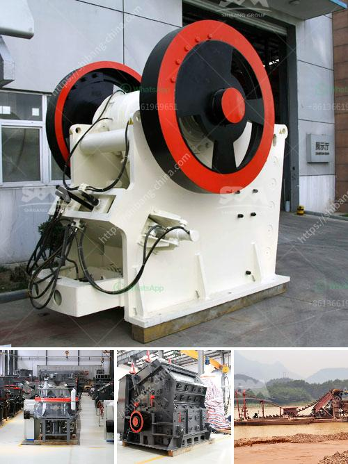

<h3>chinese companies looking for partners in africa</h3>
China's involvement in Africa has increased significantly over the past few decades. The continent has become an attractive destination for Chinese companies looking to expand their business interests, and partnerships with African counterparts have proved crucial in facilitating successful ventures. With the vast resources, untapped markets, and growing economies in Africa, Chinese companies are seeking partnerships to leverage these opportunities and secure their position in this emerging market.

Chinese companies have diversified industries and bring a wide range of expertise, including construction, infrastructure development, telecommunications, manufacturing, and technology. These companies are eager to collaborate with African businesses to mutually benefit from their respective strengths. The presence of Chinese companies has contributed to the growth of infrastructure, industrialization, and technological advancement in Africa.

One of the key motivations for Chinese companies to seek partnerships in Africa is to gain access to Africa's abundant natural resources. Resources such as oil, gas, minerals, and agricultural products are in high demand globally, and Africa possesses substantial reserves. Partnering with local African companies allows Chinese companies to establish a steady supply chain, ensuring access to these valuable resources.

Furthermore, partnering with African businesses also allows Chinese companies to take advantage of the growing market and increasing purchasing power in Africa. Africa has a population of over 1.3 billion people, many of whom are part of a burgeoning middle class seeking higher-quality goods and services. This vast consumer base presents opportunities for Chinese companies to expand their market share and boost their revenues.

The transfer of technology is another significant aspect of Chinese companies seeking partnerships in Africa. As China has rapidly developed technologically, Chinese companies possess advanced knowledge, expertise, and technologies that can be beneficial for African businesses. By partnering with African companies, Chinese companies can transfer their technological know-how, enhance local capabilities and promote technological advancement in Africa.

Moreover, Chinese companies also provide investment and funding opportunities for African businesses. The China-Africa Development Fund and the Belt and Road Initiative are examples of initiatives aiming to provide financial support and stimulate economic growth in Africa. These initiatives facilitate the creation of partnerships with African companies, accelerating development projects, and fostering economic cooperation.

While these partnerships offer numerous advantages for both sides, the relationship between Chinese companies and African counterparts also raises concerns. Critics argue that the influx of Chinese companies may lead to unfair competition, exploitation of labor, and environmental degradation. Ensuring that partnerships are based on fair trade practices, respect for labor rights, and environmental sustainability is crucial to address these concerns and ensure equitable collaborations.

In conclusion, Chinese companies are actively seeking partnerships in Africa to tap into the continent's vast resources, growing market, and technological advancements. These partnerships enable Chinese companies to gain access to Africa's natural resources, expand their market share, transfer technology, and promote economic growth. However, it is vital for all stakeholders to ensure that these partnerships are based on fairness, transparency, and sustainability, taking into account the welfare of both Chinese and African businesses, as well as the local communities.
<h3>Contact us</h3><ul><li><strong>Whatsapp:&nbsp;<a href="https://wa.me/8613661969651">+8613661969651</a></strong></li><li><a href="https://swt.shibang-china.com/?git&amp;zhl&amp;chinese companies looking for partners in africa"><strong>Online Service(chat now)</strong></a></li></ul><h3>Related</h3><ul><li><a href='price 100 tph crusher plant.md'>price 100 tph crusher plant</a></li><li><a href='ethiopia widely used rock breaking.md'>ethiopia widely used rock breaking</a></li><li><a href='crusher plant for sale in usa.md'>crusher plant for sale in usa</a></li><li><a href='calcite micron powder grinding machine in thailand.md'>calcite micron powder grinding machine in thailand</a></li><li><a href='aggregate concrete plant.md'>aggregate concrete plant</a></li></ul>