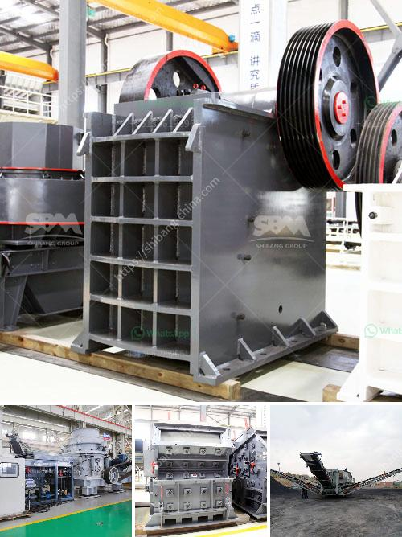

<h3>chinese limestone mining investors</h3>
Limestone, a sedimentary rock composed primarily of calcium carbonate, has become a sought-after commodity in the global construction industry. Due to its versatile nature and abundance, limestone is widely used in the production of cement, concrete, and various building materials. As the demand for these materials continues to escalate, so does the global appetite for limestone. Chinese investors have recognized the lucrative potential of limestone mining and have become significant players in this industry.

China, a rapidly developing nation with an insatiable demand for construction materials, is the largest consumer of limestone globally. To meet this ever-growing demand, Chinese investors have heavily invested in limestone mining both domestically and overseas. This investment trend has had a significant impact on the global market, making China a dominant force in the limestone mining industry.

The rise of Chinese limestone mining investors can be attributed to several factors. Firstly, China's construction industry has been booming for decades, driving the demand for limestone. With a population of nearly 1.4 billion, the need for infrastructure development, housing, and urbanization has been substantial. As a result, Chinese limestone mining investors have recognized the potential for high returns on their investments.

Secondly, China's vast industrialization and urbanization efforts have necessitated significant quantities of cement, which is a key product derived from limestone. The country's massive infrastructure projects, such as the Belt and Road Initiative, have spurred the need for cement and, consequently, for limestone mining. Thus, Chinese investors strategically seek out limestone deposits to secure a continuous supply of this essential raw material.

Furthermore, Chinese limestone mining investors have also expanded their operations overseas. Countries with abundant limestone reserves, such as Vietnam, Indonesia, and the Philippines, have attracted significant Chinese investment. Chinese investors are attracted to these nations due to their favorable geological conditions and lower operational costs. By establishing limestone mines in these countries, Chinese investors ensure a reliable supply chain for their domestic market, while also contributing to the economic development of the host countries.

However, the rise of Chinese limestone mining investors has not been without controversy. In some instances, concerns have been raised regarding the environmental impact of large-scale limestone mining. Unsustainable mining practices can lead to deforestation, habitat destruction, and groundwater contamination. It is essential for Chinese investors, as well as the governments and communities involved, to adopt sustainable mining practices that minimize environmental damage and promote responsible resource management.

In conclusion, Chinese limestone mining investors have emerged as major players in the global market, revolutionizing the industry. As China's construction industry continues to grow, the demand for limestone remains insatiable. Chinese investors recognize the profitability of limestone mining and have strategically invested in this sector both domestically and overseas. While this trend has contributed to economic growth, it is imperative that sustainable practices and environmental considerations become integral parts of limestone mining operations. With responsible management, Chinese limestone mining investors can continue fueling the global construction industry while preserving the environment for future generations.
<h3>Contact us</h3><ul><li><strong>Whatsapp:&nbsp;<a href="https://wa.me/8613661969651">+8613661969651</a></strong></li><li><a href="https://swt.shibang-china.com/?git&amp;zhl&amp;chinese limestone mining investors"><strong>Online Service(chat now)</strong></a></li></ul><h3>Related</h3><ul><li><a href='concrete crushing equipment.md'>concrete crushing equipment</a></li><li><a href='gold hammer mill suppliers in dubai.md'>gold hammer mill suppliers in dubai</a></li><li><a href='stone crushing machine in dubai.md'>stone crushing machine in dubai</a></li><li><a href='used coal wash plant canada for sale.md'>used coal wash plant canada for sale</a></li><li><a href='coal washing plant in pakistan.md'>coal washing plant in pakistan</a></li></ul>