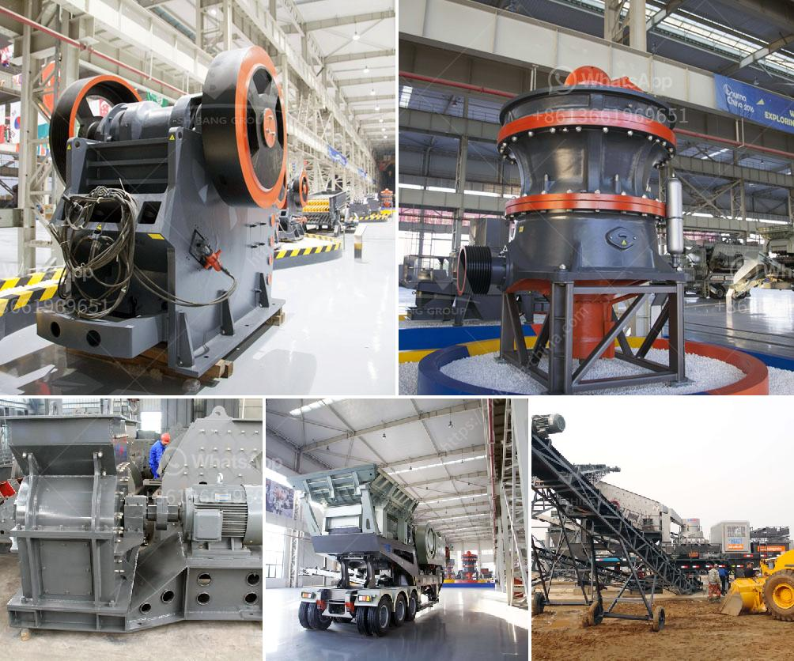

<h3>chinese mining equipment companys</h3>
Chinese mining equipment companies have emerged as a resilient industry player in the global mining sector. With advancements in technology and an increasing demand for minerals, these companies are capitalizing on opportunities and expanding their presence on a global scale.

One significant advantage that Chinese mining equipment companies possess is their ability to provide cost-effective solutions. Chinese manufacturers are known for their competitive pricing, ensuring that mining companies can maximize their returns on investment. This has propelled them ahead of their international counterparts in terms of market share.

Furthermore, these companies have also made significant strides in terms of innovation and technological advancements. They have invested heavily in research and development to enhance the performance and efficiency of their equipment. This has allowed them to provide state-of-the-art machinery that meets the specific requirements of the mining industry.

Chinese mining equipment companies are no longer limited to serving domestic markets; they have expanded their operations to cater to the growing global demand. Their reliable and efficient equipment has found its way into mining operations worldwide. Mining companies in various countries have recognized the value and reliability of Chinese mining equipment, leading to increased imports of these machines.

However, it is crucial for Chinese mining equipment companies to maintain the highest standards of quality and safety to retain their competitive edge. As the mining industry operates in environments fraught with risks, equipment reliability and safety are of paramount importance. Chinese companies need to continuously invest in quality control measures and certification processes to ensure that their equipment meets the stringent requirements of international mining standards.

In conclusion, Chinese mining equipment companies have transformed themselves into global players due to their cost-effective solutions, technological advancements, and expanding global presence. With their strong reputation, reliability, and competitive pricing, they have successfully positioned themselves as key suppliers in the global mining sector. By continuously striving for innovation and maintaining high-quality standards, these companies are poised to sustain their success in the years to come.
<h3>Contact us</h3><ul><li><strong>Whatsapp:&nbsp;<a href="https://wa.me/8613661969651">+8613661969651</a></strong></li><li><a href="https://swt.shibang-china.com/?git&amp;zhl&amp;chinese mining equipment companys"><strong>Online Service(chat now)</strong></a></li></ul><h3>Related</h3><ul><li><a href='china processing plants for sale.md'>china processing plants for sale</a></li><li><a href='pulverizer crusher manufacturer in rajkot india.md'>pulverizer crusher manufacturer in rajkot india</a></li><li><a href='gypsum powder production.md'>gypsum powder production</a></li><li><a href='gold refining equipment toronto.md'>gold refining equipment toronto</a></li><li><a href='carbon black processing machine in delhi.md'>carbon black processing machine in delhi</a></li></ul>