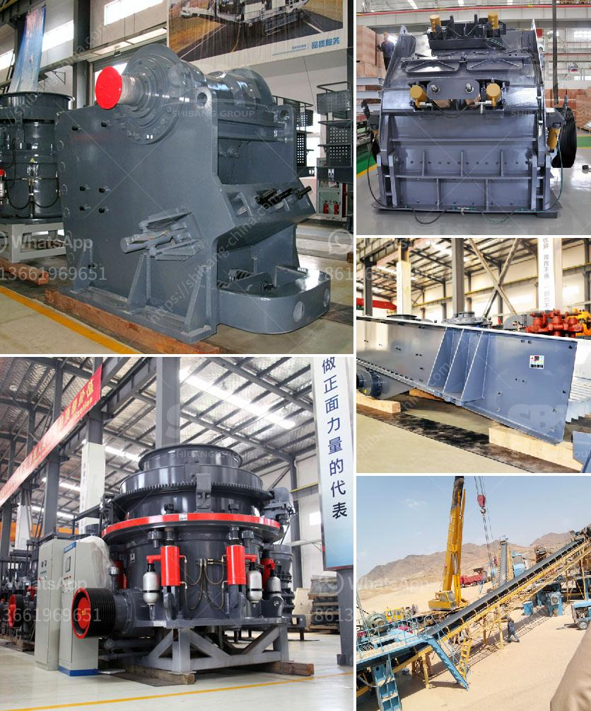

<h3>chrome wash plant for sale</h3>
Are you in the mining industry and looking for the perfect chrome wash plant for sale? Look no further! A chrome wash plant is an essential component in mining operations to extract valuable minerals from chrome ore efficiently. Whether you are a small-scale miner or a large mining operation, purchasing a high-quality wash plant is crucial to enhance productivity and maximize profits.

A chrome wash plant offers numerous benefits to miners. It effectively separates and concentrates valuable minerals like chrome ore from the surrounding rock and sand, minimizing the need for manual extraction. The plant uses various techniques such as gravity separation, magnetic separation, and dense media separation to achieve optimal results. This ensures that the chrome concentrate obtained is of high quality and can be sold at competitive prices in the market.

What makes finding the right chrome wash plant for sale essential is its ability to handle the specific needs of your mining operation. Consider factors such as the desired ore processing capacity, the availability of water and electricity, and the level of automation required. Additionally, ensure that the plant is durable, reliable, and easy to maintain to minimize downtime and maximize productivity.

Fortunately, there are numerous suppliers and manufacturers offering chrome wash plants for sale. Conduct thorough research and engage with reputable vendors who have extensive experience in providing mining solutions. Look for suppliers who offer after-sales support, including installation, training, and maintenance services. Reading customer reviews and seeking recommendations from other miners can also help narrow down your options and ensure you make an informed decision.

Investing in a chrome wash plant for sale can significantly improve your mining operation's efficiency and profitability. Enhance your mineral processing capabilities by acquiring a high-quality wash plant that meets your specific requirements. With the right equipment, you can extract and concentrate valuable chrome ore with ease, ensuring a successful and lucrative mining venture.
<h3>Contact us</h3><ul><li><strong>Whatsapp:&nbsp;<a href="https://wa.me/8613661969651">+8613661969651</a></strong></li><li><a href="https://swt.shibang-china.com/?git&amp;zhl&amp;chrome wash plant for sale"><strong>Online Service(chat now)</strong></a></li></ul><h3>Related</h3><ul><li><a href='ball mill for limestone.md'>ball mill for limestone</a></li><li><a href='impact hammer crusher.md'>impact hammer crusher</a></li><li><a href='stone crush plant 4tph.md'>stone crush plant 4tph</a></li><li><a href='mobile jaw crusher price.md'>mobile jaw crusher price</a></li><li><a href='about aggregate crushing comoany in ethiopia.md'>about aggregate crushing comoany in ethiopia</a></li></ul>