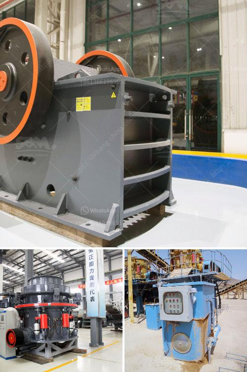

<h3>chrome washing plant in south africa</h3>
Chrome washing plants in South Africa have become the backbone of the country's chrome mining industry. Over the years, this industry has developed and grown in parallel with South Africa's economic development. It is no secret that the mining sector is a key contributor to the country's GDP, which provides the much-needed financial stability to ensure sustainable development.

The chrome washing plant plays a crucial role in processing smelting-grade chrome ore to produce metallurgical-grade ferrochrome, which is used in the production of stainless steel. Chrome ore is abundant in South Africa and it is one of the country's essential resources, with its reserves boasting around 72% of global chromite resources.

The chrome washing plants are strategically located near the mines where the ore is extracted. They are equipped with state-of-the-art machinery and technology to efficiently wash and extract the valuable chrome ore from the raw material. Through a complex process, the ore is crushed, screened, and then classified according to its particle size.

The chrome washing plants use gravity separation techniques, such as spirals and shaking tables, to separate the chromite particles from the waste material. The ore is then further processed through dense medium separation to remove impurities and improve its quality. Finally, the concentrate is dried and packaged for transportation to smelters and other processing facilities.

These chrome washing plants have not only created employment opportunities for many South Africans but also contributed significantly to the country's economy. The chrome mining industry has attracted foreign investments and created business opportunities for local suppliers and service providers.

However, it is essential to ensure that chrome mining is done responsibly and sustainably. The industry must comply with environmental regulations and implement proper waste management practices to minimize its impact on the environment.

In conclusion, chrome washing plants in South Africa have become an integral part of the chrome mining industry. They contribute to the country's economy, provide employment opportunities, and ensure the sustainable production of ferrochrome, a key ingredient in the production of stainless steel. As the industry continues to grow, it is crucial to prioritize responsible mining practices to safeguard the environment for future generations.
<h3>Contact us</h3><ul><li><strong>Whatsapp:&nbsp;<a href="https://wa.me/8613661969651">+8613661969651</a></strong></li><li><a href="https://swt.shibang-china.com/?git&amp;zhl&amp;chrome washing plant in south africa"><strong>Online Service(chat now)</strong></a></li></ul><h3>Related</h3><ul><li><a href='ball mill sale in malaysia.md'>ball mill sale in malaysia</a></li><li><a href='vibrator screen for coal.md'>vibrator screen for coal</a></li><li><a href='coal crushing suppliers in durban.md'>coal crushing suppliers in durban</a></li><li><a href='manufacturing talcum powder in india.md'>manufacturing talcum powder in india</a></li><li><a href='dry processing of coal in south africa.md'>dry processing of coal in south africa</a></li></ul>