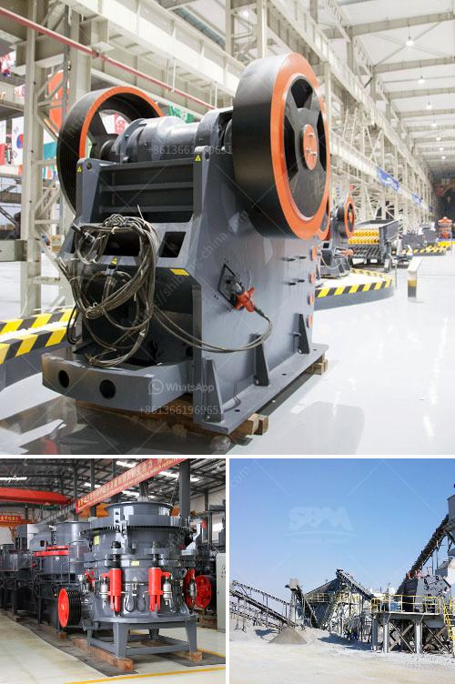

<h3>chromite ore crushing machine</h3>
Crusher machines play an important role in the mines, metallurgy, building materials, quarrying, recycling, chemical and so on industries. According to the difference of structure and working principle, the rock crushers are mainly divided into jaw crusher, cone crusher, roller crusher, impact crusher, etc. The jaw crusher is usually used as the primary crusher for chromite ore crushing. The cone crusher is for secondary crushing. The impact crusher and cone crusher are usually used in the next stage crushing process. They are suitable for hard materials that are not prone to be clogged or crushed.

Due to the limitations of chromite ore crushing machine, 200tph Chrome Ore Crushing Plant In South Africa has been developed For many years, it has been focusing on the chrome ore crushing sector in South Africa. From the understanding of the market, the market supply exceeds demand. The market competition is fierce, and the competition for crushing machines is even more intense. We would first optimize the upgrading of advanced technologies to improve the technical quality of crushing machines. In addition, through the joint accumulation of various companies, it can better increase the competitiveness of crushing machine technology and enterprise Power, secondly, strengthen market analysis, focus on understanding the situation of the entire industry chain, and seek a breakthrough in the diversification and extended use of crushing machines. The market for crushing machines is not saturated and the degree of competition is not high. According to the market analysis, South Africa's chromite ore crushing machinery sold in the market is very popular.

The jaw crusher is equipped with a patented hydraulic system. The segmented jaw plate design is advantageous for material crushing. This innovative design increases the crushing angle and the material particle shape is even. For easy maintenance, the jaw crusher can be dismantled and fixed from the top of the machine, thereby minimizing downtime for maintenance. 

The cone crusher is an advanced hydraulic crushing machine with high power, large crushing ratio, and high productivity. The machine is developed on the basis of digesting and absorbing various types of cone crushers with advanced international standards in the 1980s. It is obviously different from the traditional cone crusher in design and focusing vertical chamfering. The optimized crushing chamber improves the crushing efficiency and promotes the reliability of the equipment. The hydraulic adjustment system makes the operation more convenient, and the failure rate is relatively low, which can save a lot of maintenance and repair costs.

In conclusion, chromite ore crushing machines offer a promising crushing equipment solution to the Africa chromite mining industry. As well as other industries such as construction and metallurgy. It has the advantages of large crushing ratio, uniform particle size, simple structure, reliable work, easy maintenance, and low operating cost. Therefore, investing in a chromite ore crushing machine is a wise choice for you.
<h3>Contact us</h3><ul><li><strong>Whatsapp:&nbsp;<a href="https://wa.me/8613661969651">+8613661969651</a></strong></li><li><a href="https://swt.shibang-china.com/?git&amp;zhl&amp;chromite ore crushing machine"><strong>Online Service(chat now)</strong></a></li></ul><h3>Related</h3><ul><li><a href='quarry equipment for sale brisbane.md'>quarry equipment for sale brisbane</a></li><li><a href='crusher plant in jizan saudi arabia.md'>crusher plant in jizan saudi arabia</a></li><li><a href='jaw crusher in south africa.md'>jaw crusher in south africa</a></li><li><a href='business plan for small scale gold processing plant.md'>business plan for small scale gold processing plant</a></li><li><a href='stone crusher in cameroon.md'>stone crusher in cameroon</a></li></ul>