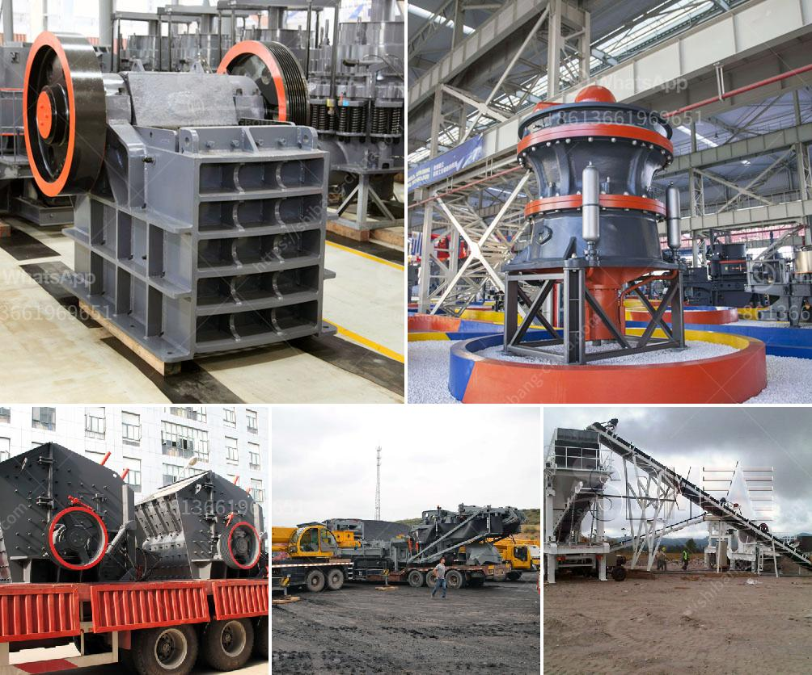

<h3>clay aggregate machinery product</h3>
The construction industry is continuously evolving, and new technologies and materials are being introduced to improve efficiency and sustainability. One such innovation is clay aggregate machinery, which has gained significant popularity in recent years. Clay aggregate machinery offers a unique and eco-friendly solution for construction projects, providing numerous benefits in terms of material quality, cost-effectiveness, and environmental impact.

Clay aggregate machinery refers to the equipment and processes used to produce expanded clay aggregates, commonly known as lightweight expanded clay aggregate (LECA). LECA is a lightweight and highly versatile construction material that is being used in a wide range of applications, including the construction of roads, buildings, and infrastructure.

The production process of LECA involves heating natural clay minerals in a rotary kiln to create lightweight pellets or balls. The clay pellets expand and harden due to the release of gases, resulting in a porous and lightweight material with excellent thermal and acoustic insulation properties.

One of the major advantages of clay aggregate machinery is the ability to produce LECA locally. Unlike traditional building materials that require transportation over long distances, LECA can be produced on-site, reducing transportation costs and carbon emissions. This is particularly advantageous in remote locations and areas with limited access to construction materials.

In addition to its eco-friendliness, clay aggregate machinery offers several other benefits. LECA is resistant to fire, frost, and moisture, making it a durable and long-lasting material that requires minimal maintenance. Its lightweight properties also reduce the weight of structures, enabling faster construction, and reducing the need for additional support structures.

Furthermore, LECA provides excellent insulation properties, reducing the energy consumption of buildings. Its porous structure allows for efficient heat and sound insulation, creating comfortable and energy-efficient living spaces. This can significantly contribute to reducing the carbon footprint of buildings and promoting sustainability in the construction industry.

The versatility of clay aggregate machinery is also worth highlighting. LECA can be used in various applications, including lightweight concrete, landscaping, and horticulture. In lightweight concrete, it acts as an aggregate, improving the strength and reducing the weight of the concrete. In landscaping and horticulture, it is used as a growing medium due to its water-retaining and drainage properties.

Prominent manufacturers of clay aggregate machinery are continuously developing and improving their products to meet the growing demands of the construction industry. Advanced technologies, such as computer-controlled kilns and automated production lines, ensure consistent and high-quality LECA production. Additionally, manufacturers are investing in research and development to explore new applications and possibilities for the use of LECA in construction.

In conclusion, clay aggregate machinery and the production of lightweight expanded clay aggregates offer innovative solutions for the construction industry. The use of LECA provides numerous benefits, including cost-effectiveness, environmental sustainability, insulation properties, and versatility. As the industry continues to prioritize sustainability and efficiency, clay aggregate machinery is poised to play a crucial role in shaping the future of construction. From reducing carbon emissions to enhancing energy efficiency, clay aggregate machinery is revolutionizing construction practices and paving the way for a greener future.
<h3>Contact us</h3><ul><li><strong>Whatsapp:&nbsp;<a href="https://wa.me/8613661969651">+8613661969651</a></strong></li><li><a href="https://swt.shibang-china.com/?git&amp;zhl&amp;clay aggregate machinery product"><strong>Online Service(chat now)</strong></a></li></ul><h3>Related</h3><ul><li><a href='design calculation of jaw crusher pdf.md'>design calculation of jaw crusher pdf</a></li><li><a href='vsi crusher manufacturer.md'>vsi crusher manufacturer</a></li><li><a href='mobile crushing plant 10x36 cost.md'>mobile crushing plant 10x36 cost</a></li><li><a href='price of quarry crusher in zimbabwe.md'>price of quarry crusher in zimbabwe</a></li><li><a href='how to start sand business in nigeria.md'>how to start sand business in nigeria</a></li></ul>