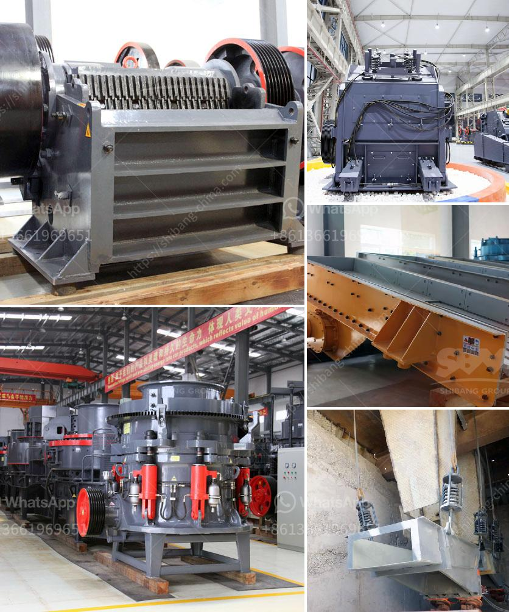

<h3>clay grinding mill machine price in china</h3>
China is rich in clay resources, and Fujian Province is an important production and export base of clay in China. At the same time, the clay grinding mill machine production line is also the strength of the dream factory performance. The more perfect its workmanship, the higher the market price. Today, we will take a look at the factors that determine the price of the clay grinding mill machine.

Firstly, the size and model of the clay grinding mill machine. The larger the size, the higher the price. The larger the model, the higher the price. Different manufacturers have different specifications and models of clay grinding mill machines, so the price will vary. Users should choose the appropriate model according to their actual production needs and budget.

Secondly, the technology and production proficiency of the manufacturer. The level of technology and production proficiency of the manufacturer directly affects the quality and performance of the clay grinding mill machine. The better the technology and proficiency, the higher the price. In China, there are many manufacturers of clay grinding mill machines, each with its own advantages and disadvantages. When purchasing, users should choose a reputable manufacturer with good reputation and high-quality products.

Thirdly, the material and production cost of the clay grinding mill machine. The higher the quality of the materials used, the higher the cost of production, resulting in a higher price of the clay grinding mill machine. Good materials can improve the overall performance and service life of the machine, reduce maintenance costs, and increase productivity. Therefore, users should pay attention to the quality of the materials used by the manufacturer when purchasing.

Fourthly, the after-sales service. The after-sales service is also an important factor that affects the price of the clay grinding mill machine. Good after-sales service can provide users with various services such as installation, commissioning, training, and maintenance, which can effectively solve problems encountered by users during use. Therefore, when purchasing, users should not only pay attention to the price but also pay attention to the comprehensive after-sales service provided by the manufacturer.

In conclusion, the price of the clay grinding mill machine in China is determined by factors such as the size and model of the machine, the technology and proficiency of the manufacturer, the material and production cost, and the after-sales service. Users should choose a suitable manufacturer and model according to their actual production needs and budget, and pay attention to the comprehensive evaluation of the manufacturer's technology, quality, and service. With the continuous improvement of technology, the price of clay grinding mill machines in China will continue to be more reasonable, and the market prospects are very promising.
<h3>Contact us</h3><ul><li><strong>Whatsapp:&nbsp;<a href="https://wa.me/8613661969651">+8613661969651</a></strong></li><li><a href="https://swt.shibang-china.com/?git&amp;zhl&amp;clay grinding mill machine price in china"><strong>Online Service(chat now)</strong></a></li></ul><h3>Related</h3><ul><li><a href='rock crusher cone.md'>rock crusher cone</a></li><li><a href='different types of coal pulverizing ball mills.md'>different types of coal pulverizing ball mills</a></li><li><a href='silica powder making machinery in haiti.md'>silica powder making machinery in haiti</a></li><li><a href='coal crushing equipment.md'>coal crushing equipment</a></li><li><a href='mining mobile crusher and washing lebanon.md'>mining mobile crusher and washing lebanon</a></li></ul>