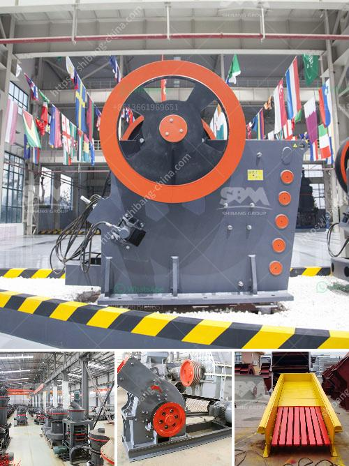

<h3>clay grinding plant</h3>
Clay grinding plant is a crucial step in the production process of clay materials. During clay grinding, material is grinded into fine powder through the impact and grinding of steel balls inside the mill. The clay powder is then conveyed to storage silos and finally dispatched to various consumers.

The grinding process is an essential part of many industrial plants, as it reduces the size of the raw materials and allows for easier handling and processing. In the case of clay grinding plants, this process is particularly important as it transforms the clay into a more usable form for further applications.

One of the main benefits of clay grinding plants is the increased efficiency in the production of clay-based products. By grinding the clay to a fine powder, it becomes more reactive when mixed with other materials, improving its performance in applications such as ceramics, coatings, and construction materials.

Another advantage of clay grinding plants is the enhanced control over the final product's quality. Through precise grinding techniques, manufacturers can ensure that the clay powder has a consistent particle size distribution, which is crucial for achieving the desired properties in the end product.

Furthermore, clay grinding plants contribute to the overall sustainability of manufacturing processes. By grinding the clay, manufacturers can reduce the amount of raw material needed for production, leading to a more resource-efficient approach. Additionally, grinding the clay also reduces the energy required for further processing, resulting in lower energy consumption and carbon emissions.

In conclusion, clay grinding plants play a vital role in the production of clay-based products. Through the grinding process, the clay is transformed into a more usable and reactive form, contributing to improved product performance and quality control. Furthermore, these plants also promote sustainability by reducing raw material consumption and energy requirements. Overall, clay grinding plants are a crucial component in the manufacturing industry, enabling the production of a wide range of clay-based products used in various sectors.
<h3>Contact us</h3><ul><li><strong>Whatsapp:&nbsp;<a href="https://wa.me/8613661969651">+8613661969651</a></strong></li><li><a href="https://swt.shibang-china.com/?git&amp;zhl&amp;clay grinding plant"><strong>Online Service(chat now)</strong></a></li></ul><h3>Related</h3><ul><li><a href='stone crusher plant layout.md'>stone crusher plant layout</a></li><li><a href='equipments of copper processing.md'>equipments of copper processing</a></li><li><a href='project cost estimation for iron ore pellet plant.md'>project cost estimation for iron ore pellet plant</a></li><li><a href='cyanide processing plants for sale usa.md'>cyanide processing plants for sale usa</a></li><li><a href='200tph vsi crushers.md'>200tph vsi crushers</a></li></ul>