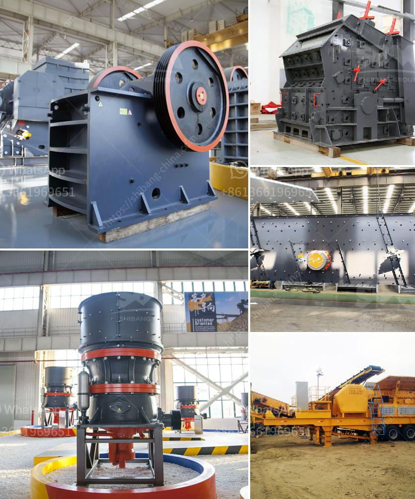

<h3>clay processing techniques</h3>
Clay, a versatile and abundant natural material, has been utilized by civilizations throughout history for pottery, sculpture, and various other crafts. Clay processing techniques play a crucial role in transforming raw clay into functional and aesthetically pleasing objects. This article explores some key methods and tools used in clay processing, showcasing the artistry and skill required to harness the full potential of this medium.

Before clay can be shaped and molded, it needs to be prepared. The initial stage involves wedging, which entails repeatedly folding and kneading the clay to create a smooth and uniform consistency. Wedging removes air bubbles and ensures an even texture, making the clay easier to handle.

One of the oldest clay processing techniques, handbuilding reflects the artist's skill in shaping clay entirely by hand. Pinch pottery involves forming the clay by pinching and shaping it with the fingers. Coiling is another method where long, snake-like rolls of clay are progressively stacked and blended to create vessels or sculptures. Slab construction involves cutting large sheets of clay and assembling them into desired shapes, allowing for more precision and control.

The pottery wheel revolutionized clay processing, offering artists greater control and symmetry in their creations. Throwing, a method used on the wheel, involves centering the clay on a rotating platform and manipulating it with hands and tools to shape vessels such as bowls, cups, and vases. This technique allows artists to create uniform shapes and smooth surfaces in less time than traditional handbuilding techniques.

Once the primary form is achieved, artists employ various techniques to decorate the surface of their clay pieces. Slip trailing involves applying clay slip (liquid clay) to create fine lines, intricate patterns, or raised designs. Sgraffito involves scratching through layers of differently colored slips or underglazes to create contrasting designs. Glazing, a common technique, involves applying a layer of liquid glass that, when fired, creates a glossy, protective coating and adds color and shine to the clay piece.

Firing is a vital step that transforms clay from its fragile and porous state into a solid and durable material. There are two types of firing: bisque firing, which removes the clay's physical water and makes it ready for glazing, and glaze firing, which fuses the glaze to the clay surface, creating a finished and permanent piece. The firing process requires careful control of temperature to avoid cracking, warping, or melting of the clay.

Clay processing techniques are a convergence of artistry, skill, and scientific understanding. From initial clay preparation to the final touches of firing, each step requires precision and knowledge to achieve desired outcomes. Handbuilding techniques offer organic and unique forms, while the pottery wheel is ideal for producing consistent and symmetrical vessels. Surface decoration techniques allow artists to add flair and personal expression to their clay pieces. Lastly, firing brings the artwork to life and transforms it into a durable and timeless creation. So, whether you're an aspiring artist or an admirer of clay art, understanding these clay processing techniques helps you appreciate the craftsmanship behind the mesmerizing world of ceramic art.
<h3>Contact us</h3><ul><li><strong>Whatsapp:&nbsp;<a href="https://wa.me/8613661969651">+8613661969651</a></strong></li><li><a href="https://swt.shibang-china.com/?git&amp;zhl&amp;clay processing techniques"><strong>Online Service(chat now)</strong></a></li></ul><h3>Related</h3><ul><li><a href='hammer mill mesin impor china.md'>hammer mill mesin impor china</a></li><li><a href='gypsum crushing machine price.md'>gypsum crushing machine price</a></li><li><a href='limestone processes of landscape.md'>limestone processes of landscape</a></li><li><a href='sand sieving machine by vibrating system chennai.md'>sand sieving machine by vibrating system chennai</a></li><li><a href='jaw crushers prices in zimbabwe.md'>jaw crushers prices in zimbabwe</a></li></ul>