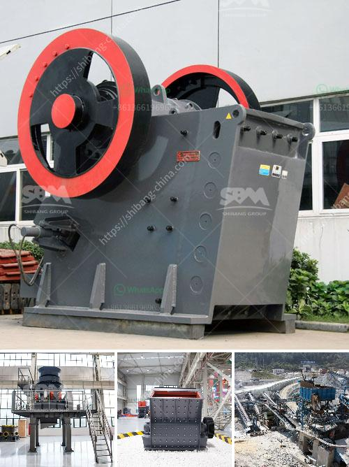

<h3>clinker grinding plant india</h3>
Clinker grinding plant in India is an indispensable part of the cement manufacturing process. With India’s high infrastructural growth, the cement sector is expected to witness a surge in demand. This is expected to result in an increase in the number of clinker grinding plants in the country. With the rise in demand, manufacturers are looking to expand their capacities and invest in efficient clinker grinding plants to meet the growing needs.

A clinker grinding plant is a specialized factory that grinds clinker into fine powders to manufacture cement. The grinding process is usually carried out in large ball mills or vertical roller mills. The fine clinker material is blended with gypsum and other additives to produce cement.

In India, there are several clinker grinding plants that are designed and built with state-of-the-art technology to ensure maximum efficiency and consistent quality of cement. These plants can produce up to 2 million tons of cement a year.

Clinker grinding plants in India are characterized by high energy efficiency and low operating costs compared to other types of cement production plants. This is due to the use of modern and advanced technology, which reduces fuel consumption and electricity usage.

Furthermore, these plants are also equipped with pollution control systems to meet the stringent environmental regulations. The incorporation of pollution control systems ensures that the clinker grinding plants operate in an environmentally friendly manner.

In conclusion, the clinker grinding plant industry in India is witnessing significant growth due to the increasing demand for cement in the country. Manufacturers are expanding their capacities and investing in efficient and environment-friendly grinding plants to meet the surging demand. This is expected to further drive the growth of the cement industry and contribute to India’s infrastructural development.
<h3>Contact us</h3><ul><li><strong>Whatsapp:&nbsp;<a href="https://wa.me/8613661969651">+8613661969651</a></strong></li><li><a href="https://swt.shibang-china.com/?git&amp;zhl&amp;clinker grinding plant india"><strong>Online Service(chat now)</strong></a></li></ul><h3>Related</h3><ul><li><a href='quartz stone powder machinery manufacturing companies.md'>quartz stone powder machinery manufacturing companies</a></li><li><a href='ball mills in monterrey.md'>ball mills in monterrey</a></li><li><a href='crusher stone sand making stone quarry.md'>crusher stone sand making stone quarry</a></li><li><a href='price hammer crusher nigeria.md'>price hammer crusher nigeria</a></li><li><a href='ball mill supplier in malaysia pakistan.md'>ball mill supplier in malaysia pakistan</a></li></ul>