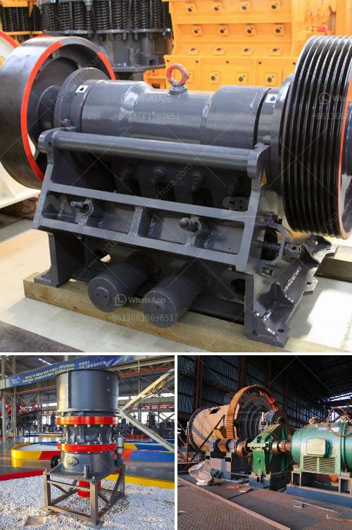

<h3>clinker grinding plant setup cost in india</h3>
India is emerging as one of the fastest-growing economies in the world and as a result, its cement industry is experiencing significant growth. This is fueling the demand for cement clinker grinding plants across the country. Similarly, cement clinker grinding plant cost in India is also getting higher and higher. This will ultimately push the clinker grinding plant investment towards future profits.

In cement production line, cement grinding process is the important step. In the cement grinding process, vertical mill is the main cement grinding equipment used for clinker grinding in cement plants. Nowadays, there are various types of cement grinding plants in India. However, clinker grinding plant setup cost is largely dependent on the type of cement grinding mill used.

There are many types of cement grinding mills available in the market today. These mills are namely: vertical roller mill, VRMs, ball mills, and clinker grinding system etc. Nevertheless, the vertical roller mill is the most expensive one amongst these options, as it costs around INR 90 lakh to set up this plant.

Also, the installation cost of a cement grinding unit is around 40% of the investment required to set up a cement plant. How much does it cost to start a cement plant? Cost of setting up a cement plant in India is around Rs. 1400 crores.

The cement industry in India is dotted with large and small cement plants. The top 5 cement companies in India constitute more than 50% of the total cement production in the country. Here is a list of the top 5 cement companies in India with their plant locations and production capacity:

These cement companies have installed production capacities as high as 65 MTPA. However, setting up a clinker grinding plant is not very simple and requires a lot of investment and planning.

Clinker grinding plants are planned with a view to catering to the growing demands of the local market. This prefeasibility study consists of financial viability, breakeven and profit analysis, wherein the opportunities available in the Indian market as well as the challenges faced by industry players have been thoroughly discussed.

The clinker grinding plant layouyt, equipment selection, terminal construction, etc. ultimately depends on the requirements of the end users. However, some common equipment used in are mentioned below:

Setting up a clinker grinding plant requires meticulous planning and a systematic approach. The whole process is broken down into 4 steps, which are:

In conclusion, setting up a clinker grinding plant in India requires a meticulous planning and a systematic approach. The cost of operating the plant can be reduced by lowering the variable cost items. Investing in a clinker grinding plant can help cement manufacturers gain consistent profits by selling excess clinker produced in-house.
<h3>Contact us</h3><ul><li><strong>Whatsapp:&nbsp;<a href="https://wa.me/8613661969651">+8613661969651</a></strong></li><li><a href="https://swt.shibang-china.com/?git&amp;zhl&amp;clinker grinding plant setup cost in india"><strong>Online Service(chat now)</strong></a></li></ul><h3>Related</h3><ul><li><a href='cornerstone equipment used rock crushers.md'>cornerstone equipment used rock crushers</a></li><li><a href='jaw crusher of zenith.md'>jaw crusher of zenith</a></li><li><a href='rock stone crusher.md'>rock stone crusher</a></li><li><a href='bentonite processing.md'>bentonite processing</a></li><li><a href='raymond mill to crusher quartz to 1500 mesh.md'>raymond mill to crusher quartz to 1500 mesh</a></li></ul>