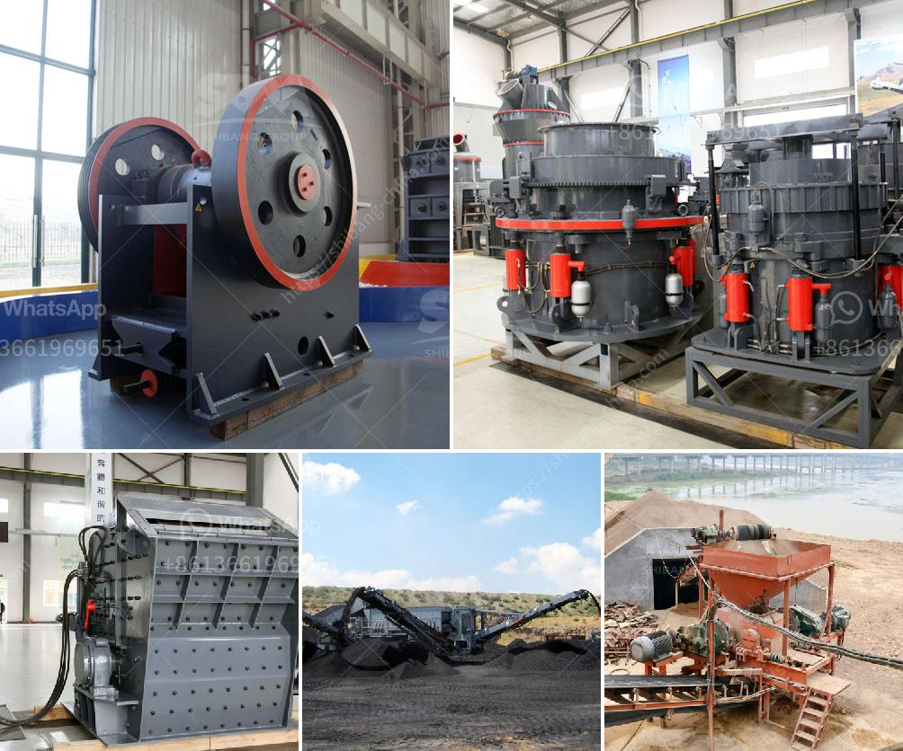

<h3>clinker production process</h3>
Clinker production process, also known as cement production process, is a complex and energy-intensive series of steps. It involves heating raw materials such as limestone, clay, and iron ore in a rotary kiln at temperatures exceeding 1400 degrees Celsius. This process transforms the raw materials into clinker, which is the semi-finished form of cement. In this article, we will explore the clinker production process in detail.

The first step in the clinker production process is the extraction of raw materials. Limestone, clay, and iron ore are quarried and then crushed into small pieces. These materials are then transported to a blending silo, where they are mixed in the correct proportions to achieve the desired chemical composition.

Once the raw materials are blended, they are fed into a preheater tower. In the preheater tower, the materials are heated by hot gases to temperatures of around 800 degrees Celsius. This preheating process helps to reduce the energy consumption in the rotary kiln and also removes moisture from the raw materials.

From the preheater tower, the materials are then transferred to the rotary kiln. The rotary kiln is a large, cylindrical furnace lined with refractory bricks. It rotates slowly and is inclined at a slight angle. As the materials move through the rotary kiln, they are subjected to intense heat.

Inside the rotary kiln, the raw materials undergo a series of chemical reactions known as calcination. During calcination, the limestone decomposes to form calcium oxide, or lime, and carbon dioxide. This reaction releases a significant amount of heat, which contributes to the high temperatures in the kiln.

The clinker produced in the rotary kiln is a small, dark grey nodular material. It is then cooled by air or water to bring it to a temperature suitable for grinding. The cooled clinker is then ground to a fine powder with the addition of a small amount of gypsum. This ground clinker, along with gypsum, is commonly referred to as Portland cement.

The clinker production process is highly energy-intensive, accounting for a significant portion of the total energy consumption in the cement industry. The high temperatures required in the rotary kiln, as well as the operation of various auxiliary equipment, contribute to the energy consumption.

Efforts are being made to improve the energy efficiency of the clinker production process. Various technologies, such as alternative fuels, waste heat recovery systems, and innovative kiln designs, are being explored to reduce energy consumption and greenhouse gas emissions.

In conclusion, the clinker production process is a critical step in cement manufacturing. It involves the extraction and processing of raw materials, followed by the transformation of these materials into clinker through high-temperature calcination. The clinker is then cooled and ground to produce Portland cement. While energy-intensive, efforts are underway to improve the energy efficiency of the clinker production process and reduce its environmental impact.
<h3>Contact us</h3><ul><li><strong>Whatsapp:&nbsp;<a href="https://wa.me/8613661969651">+8613661969651</a></strong></li><li><a href="https://swt.shibang-china.com/?git&amp;zhl&amp;clinker production process"><strong>Online Service(chat now)</strong></a></li></ul><h3>Related</h3><ul><li><a href='gypsum production process plant design.md'>gypsum production process plant design</a></li><li><a href='second hand sand making machine cost.md'>second hand sand making machine cost</a></li><li><a href='used hammer mill crusher.md'>used hammer mill crusher</a></li><li><a href='coal washing plant drawing.md'>coal washing plant drawing</a></li><li><a href='crusher plant project cost.md'>crusher plant project cost</a></li></ul>