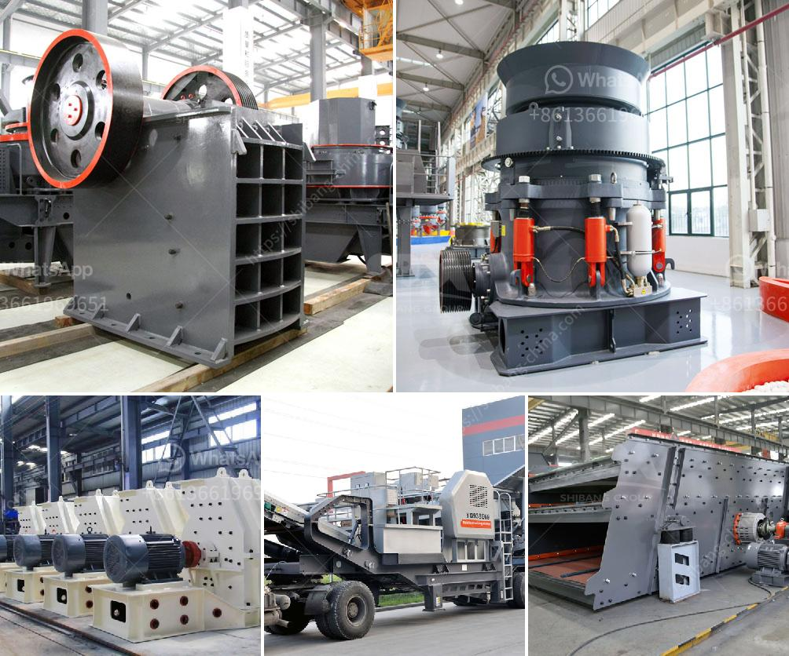

<h3>coal crusher equipment</h3>
As the necessity of energy saving becomes more apparent, efficient coal-fired power plants are becoming increasingly popular. Coal crusher equipment is the main machine to crush coal with low energy consumption, high output and low price for sale.

In coal preparation plants, the crushing operation should be adapted to the requirements of the selected particles; in order to select the fine baking from the coal, the crushed coal should be broken into smaller particles to separate the coal and meter; to meet the user’s particle requirements, the product or coal is quickly pulverized to a certain particle size. Coal crusher is a type crusher of ore crushing equipments used for crushing coal.

Coal crusher is acknowledged well in coal processing industry for a long time. It is used widely in coal mining and coal processing because of its advantages. In the coal crushing plant, coal crusher can resize the coal stone so that it can be easily handled and processed.

Coal crushers play an important role in moving product from mine-head to market. Typically used in open-cast mining to regulate the flow of coal onto the conveyor belt, Coal Crushers not only facilitate production rates by preventing over-sized cargo from clogging the material handling system, but provide value to end-users by delivering coal sized to order as such it offers significant cost savings in terms of logistics.

Despite their importance, many coal crushers do not receive significant attention in terms of design and optimization, unlike other crushers used on other plants. Here are some important points to consider when evaluating crushers:

- Efficiency: crusher efficiency impacts the overall production rate of coal. A well-designed crusher can achieve a higher production rate through less downtime and a lower maintenance cost.

- Cost savings: Crushers are often used in mines to break down ore material, making coal crusher equipment highly demanded. However, coal crusher equipment can be expensive. Therefore, to reduce the overall cost of coal crushing, users should consider using efficient and low-cost coal crusher equipment when selecting crushers.

- Futurism: With highly efficient design and high technology, coal crushing equipment can offer exceptional performance in terms of thousands of hours of operation, providing even longer life expectancy in tons of coal produced per hour.

In summary, coal crusher equipment is designed to process coals of various hardnesses and are used for power generation or heating purposes in mining operations. Reducing the overall cost of the coal crushing operation is an important aspect of improving efficiency and increasing profitability.
<h3>Contact us</h3><ul><li><strong>Whatsapp:&nbsp;<a href="https://wa.me/8613661969651">+8613661969651</a></strong></li><li><a href="https://swt.shibang-china.com/?git&amp;zhl&amp;coal crusher equipment"><strong>Online Service(chat now)</strong></a></li></ul><h3>Related</h3><ul><li><a href='jaw crusher of zenith.md'>jaw crusher of zenith</a></li><li><a href='rock crushers in south africa.md'>rock crushers in south africa</a></li><li><a href='marble mining equipment.md'>marble mining equipment</a></li><li><a href='cost of crusher run in las vegas.md'>cost of crusher run in las vegas</a></li><li><a href='concrete crushing equipment.md'>concrete crushing equipment</a></li></ul>