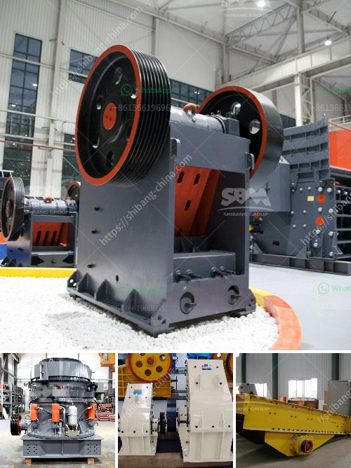

<h3>coal crusher machine in south africa</h3>
Coal in South Africa is abundant in the Limpopo province and is also found in the Durban and Witbank regions. South Africa’s coal resources primarily come from its high-quality bituminous coal deposits, which are classified as either underground or open-pit mining.

To effectively utilize these coal resources, a coal crusher machine is necessary. Types of coal crusher machines are varied, including roll crusher, hammer crusher, and jaw crusher.

Coal crusher machine is designed for efficient and low consumption crushing. The coal crusher machine reduces the wasted coal particle size by crushing, and the coal crusher machine progressively crushes the coal so that the moisture and particle size are reduced during the coal crushing process. As a result, the coal is crushed into smaller and more uniform particles, which can improve the efficiency of coal combustion.

In South Africa, coal crusher machines are widely used in the mining industry, especially for coal crushing. The coal crusher machine relies on a combination of high-speed impacts and attrition to crush coal particles into fine particles. Crushing requires less energy compared to pulverizing and is highly efficient in coal processing.

The coal crusher machine plays a vital role in coal processing, contributing to the overall efficiency of coal utilization and environmental protection. South Africa's coal resources are vast, and utilizing them effectively can help the country meet its energy demands and reduce its dependence on other energy sources. Therefore, investing in coal crusher machine in South Africa is highly recommended for coal mining and processing industries.
<h3>Contact us</h3><ul><li><strong>Whatsapp:&nbsp;<a href="https://wa.me/8613661969651">+8613661969651</a></strong></li><li><a href="https://swt.shibang-china.com/?git&amp;zhl&amp;coal crusher machine in south africa"><strong>Online Service(chat now)</strong></a></li></ul><h3>Related</h3><ul><li><a href='complete crushing plant 150 200t.md'>complete crushing plant 150 200t</a></li><li><a href='china ball valve grinding machine.md'>china ball valve grinding machine</a></li><li><a href='old hammer mill for sale.md'>old hammer mill for sale</a></li><li><a href='gold hammer mill suppliers in dubai.md'>gold hammer mill suppliers in dubai</a></li><li><a href='american cone crushers.md'>american cone crushers</a></li></ul>