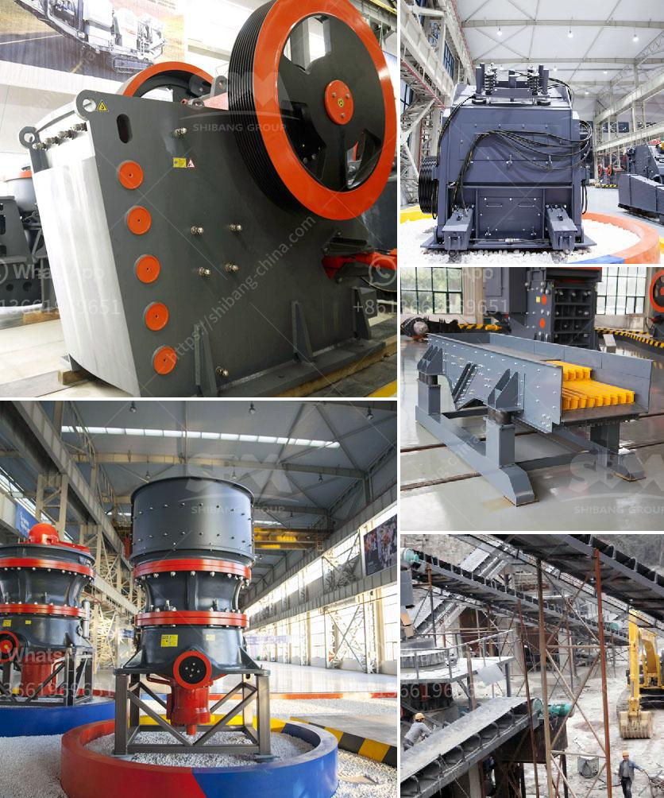

<h3>coal crusher machine manufacturer in india</h3>
Coal Crusher Machine manufacturer in India is an ideal choice for crushing the raw coal using the coal crusher machine manufacturer in India, YEC Jaw Crusher is used as primary crushing machine in stone quarry, mineral ore mining,jaw crusher manufacturer in China YEC. YEC crushing and grinding equipment manufacturer in India YEC Jaw Crusher is the leading manufacturer of Crushing Equipment in India . YEC began as a pioneer brand in the field of crushing Equipments.

Our well experience, dedicated team with well-equipped workshop made YEC jaw crusher a brand name in the market in the field of Crushing Equipment. The YEC Jaw Crusher provides a crushing ratio of 4-6. Our jaw crushers are capable of crushing the toughest rock with high reliability.

Leading Manufacturer of MS Coal Crusher Machine, Automatic Coal Crusher Machine, Coal Crusher Machine, Charcoal Crusher Machine and Portable Coal Crusher Machine. We are looking inquiries majorly from customers in Andhra Pradesh, Chhattisgarh, Jharkhand, Madhya Pradesh, Maharashtra, Odisha, Telangana.

Leading Manufacturer of Ms Coal Screening Machine, Electric Coal Screening Machine, Rectangular MS Coal Screening Machine, Twin Shaft Coal Screening Machine and Four Shaft Coal Screening Machine from Mumbai.

YEC Coal Screening Machine Manufacturer in India is manufactured from Shanghai Xuanshi and it is the main mineral processing solutions. From heavy-duty scalping screens to fine screening machines, YEC coal screening machines are reliable and efficient.

Coal washing is an integral part of the coal production process in India. Coal Washing is one of the most important stages in the process of preparation of coal. It is mandatory to remove the undesirable impurities from the coal before it is fed to the end-user. Similarly, coal washeries also provide fuel for domestic and industrial uses in India. Coal Washing can treat run-of-mine coal as well as discard coal into products. Coal Washing is one of the most important stages in the coal processing plant.

Manufacturer of Coal Crusher Machine manufacturer in India, HSI Impactor manufacturer in India & Vibrating Screen manufacturer in India offered by Pals & Company from Gurgaon, Haryana, India.

YEC Coal Crusher Machine manufacturer in India offer types of crusher for coal, coal crusher machine, coal crushing plant, coal crusher machine manufacturer in india, india coal crusher machine manufacturer, YEC,Jaw Crusher is the leading manufacturer of Crushing Equipment in India .

YEC began as a pioneer brand in the field of crushing Equipments. Our well experience, dedicated team with well-equipped workshop made YEC jaw crusher a brand name in the market in the field of Crushing Equipment. The YEC Jaw Crusher provides a crushing ratio of 4-6. Our jaw crushers are capable of crushing the toughest rock with high reliability.
<h3>Contact us</h3><ul><li><strong>Whatsapp:&nbsp;<a href="https://wa.me/8613661969651">+8613661969651</a></strong></li><li><a href="https://swt.shibang-china.com/?git&amp;zhl&amp;coal crusher machine manufacturer in india"><strong>Online Service(chat now)</strong></a></li></ul><h3>Related</h3><ul><li><a href='cornerstone equipment used rock crushers.md'>cornerstone equipment used rock crushers</a></li><li><a href='jaw crusher process description.md'>jaw crusher process description</a></li><li><a href='rock crushers for sale south africa.md'>rock crushers for sale south africa</a></li><li><a href='rock crushers in south africa.md'>rock crushers in south africa</a></li><li><a href='ball mill grinding media.md'>ball mill grinding media</a></li></ul>