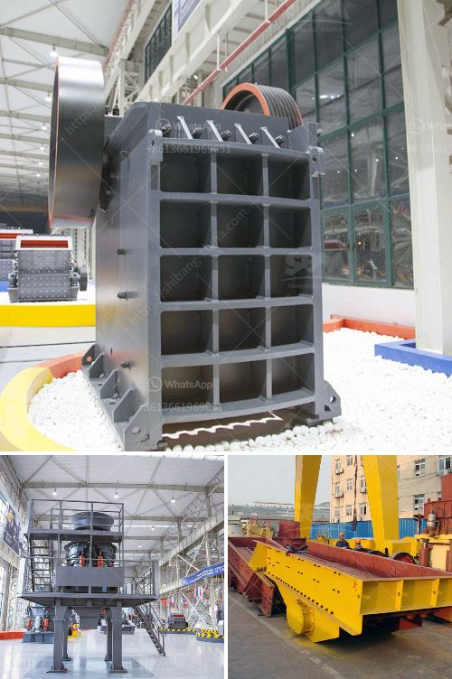

<h3>coal crushing equipment</h3>
Coal is a black or brownish-black sedimentary rock that is primarily composed of carbon. It is widely used in the electricity generation industry as a fuel source, providing about 40% of the world's electricity needs. Due to its abundance and affordability, coal remains a dominant energy source in many countries.

However, before coal can be used as a fuel, it needs to go through a series of crushing and milling processes. The purpose of this article is to provide an overview of the coal crushing equipment available in the market today.

Coal crushers play a vital role in the coal crushing process for power plants or coal preparation plants. While the coal crushers are commonly classified into primary, secondary, and tertiary crushers based on their stage of crushing, they can also be divided into simple coal crushers, such as jaw crusher, impact crusher, cone crusher, etc., and complex coal crushers, such as impact crusher and roll crusher. Here, we focus on the simple coal crushers.

Typically, coal crushers are used in primary crushing or secondary crushing process. They are classified according to the size of the crushed coal, which can be from 10 mm to 500 mm. The most common types of coal crushers include jaw crusher, impact crusher, cone crusher, and hammer crusher.

Jaw crusher: Jaw crusher is one of the most commonly used coal crushers. It is widely used in the primary crushing stage because of its large feeding size and high crushing capacity. Its advantages include high crushing ratio, uniform particle size, simple structure, reliable performance, and easy maintenance.

Impact crusher: Impact crusher is another popular crusher for coal crushing. It is featured with high crushing ratio, large crushing capacity, and easy maintenance. Its advantages include compact structure, adjustable discharge size, and simplified crushing process. However, it is not suitable for crushing coal with high moisture content.

Cone crusher: Cone crusher is a versatile crusher that is used to crush coal at various stages of crushing. It is also an effective crusher to crush coal for secondary crushing. The cone crusher is characterized by high crushing ratio, high efficiency, low energy consumption, and uniform particle size.

Hammer crusher: Hammer crusher is a type of coal crusher that features a simple structure, large crushing ratio, and high production efficiency. It is suitable for both dry and wet crushing of brittle materials, such as coal, coal gangue, coke, slag, shale, limestone, etc. Its disadvantages include large size, high power consumption, and vulnerable hammer heads.

In conclusion, coal crushing equipment plays a vital role in the coal preparation process. The primary purpose of coal crushers is to reduce the size of coal for further processing. It is essential to choose the right crusher equipment that matches the coal characteristics and the desired product specifications. By understanding the various types of coal crushers available in the market, coal preparation plants can make informed decisions to optimize their operations and maximize the efficiency of coal utilization.
<h3>Contact us</h3><ul><li><strong>Whatsapp:&nbsp;<a href="https://wa.me/8613661969651">+8613661969651</a></strong></li><li><a href="https://swt.shibang-china.com/?git&amp;zhl&amp;coal crushing equipment"><strong>Online Service(chat now)</strong></a></li></ul><h3>Related</h3><ul><li><a href='materials hammer mill.md'>materials hammer mill</a></li><li><a href='quartz manufacturing plant in tamilnadu.md'>quartz manufacturing plant in tamilnadu</a></li><li><a href='ballast crushing machine prices in kenya.md'>ballast crushing machine prices in kenya</a></li><li><a href='used crushing quarry plant in south africa stone.md'>used crushing quarry plant in south africa stone</a></li><li><a href='continuous ball mill capacity 500 hr.md'>continuous ball mill capacity 500 hr</a></li></ul>