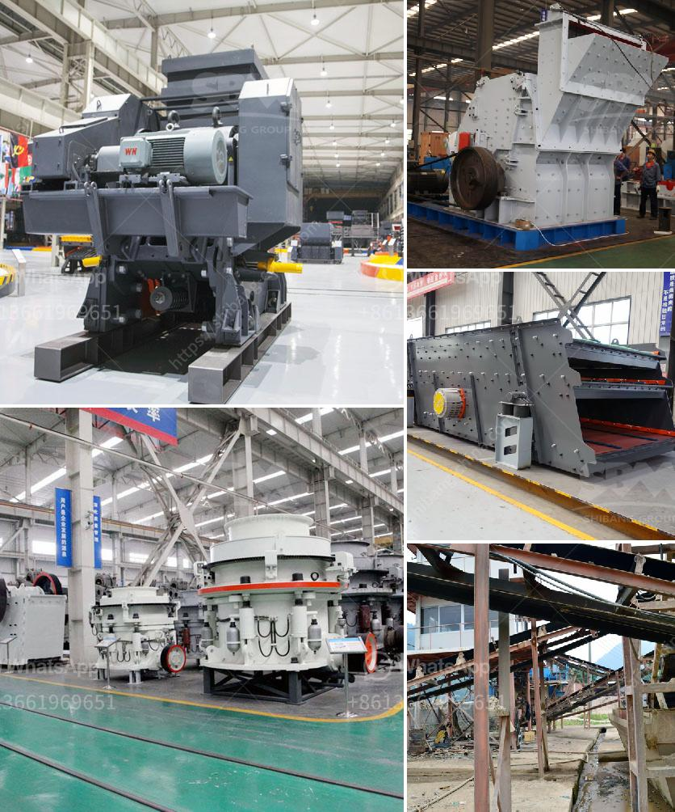

<h3>coal crushing suppliers in durban</h3>
Coal crushing is the first stage in coal preparation operation, which is essential for efficient and clean utilization of coal. Suppliers of coal crushing equipment in Durban strive to make coal processing simpler and more efficient, enabling the fossil fuel to play a vital role in meeting the energy needs of various industries throughout the region.

Coal crushing equipment suppliers in Durban provide a wide range of crushing machines to facilitate the coal processing operation. These machines are designed in a way that they can easily handle even the hardest coals while ensuring high performance and durability. Various types of crushers are available, including jaw crushers, impact crushers, cone crushers, and hammer crushers.

Jaw crushers are commonly used for the primary crushing of coal. They are robust in construction, reliable in operation, and capable of handling large quantities of coal. The jaw crusher consists of a fixed jaw and a movable jaw, which are both subjected to a complex motion to break down the coal into smaller sizes. This machine is ideal for producing a consistent size of coal particles for further processing.

Impact crushers are another popular choice for coal crushing. They rely on impact rather than pressure to crush the coal. These crushers are capable of producing a high ratio of reduction and a uniform product size. The feed material is picked up by rotor hammers, impacting against the breaker plates. This process leads to the material being crushed to the desired size and discharged through the outlet.

Cone crushers are used when a finer product is required. These crushers have a gyrating cone that crushes the coal between the cone and the surrounding bowl. The crushed material then exits through the discharge opening, producing a product of uniform size. Cone crushers are known for their high capacity and low maintenance requirements, making them suitable for large-scale coal processing operations.

Hammer crushers are used for secondary and tertiary coal crushing. They have high throughputs and are capable of producing a wide range of particle sizes. These crushers consist of a rotor with hammers that strike the coal and break it against breaker plates. The crushed coal then falls through the bottom of the machine, ready for further downstream processing.

Coal crushing equipment suppliers in Durban understand the importance of providing high-quality products that are both efficient and reliable. They work closely with their customers to understand their specific needs and requirements, ensuring that the equipment provided is tailored to meet their unique coal crushing demands. These suppliers also offer comprehensive after-sales services, including installation, commissioning, and ongoing maintenance and repairs.

In conclusion, suppliers of coal crushing equipment in Durban play a crucial role in ensuring the efficient and clean utilization of coal. They provide a wide range of crushing machines that are capable of handling various types of coal and producing consistent sizes of coal particles. By offering high-quality products and comprehensive after-sales services, these suppliers contribute to the overall success of the coal processing industry in Durban and the surrounding regions.
<h3>Contact us</h3><ul><li><strong>Whatsapp:&nbsp;<a href="https://wa.me/8613661969651">+8613661969651</a></strong></li><li><a href="https://swt.shibang-china.com/?git&amp;zhl&amp;coal crushing suppliers in durban"><strong>Online Service(chat now)</strong></a></li></ul><h3>Related</h3><ul><li><a href='minimum output size in jaw crusher.md'>minimum output size in jaw crusher</a></li><li><a href='feldspar crusher cost.md'>feldspar crusher cost</a></li><li><a href='price of ball mill.md'>price of ball mill</a></li><li><a href='granite crusher machines.md'>granite crusher machines</a></li><li><a href='stone crusher for sale price in dubai.md'>stone crusher for sale price in dubai</a></li></ul>