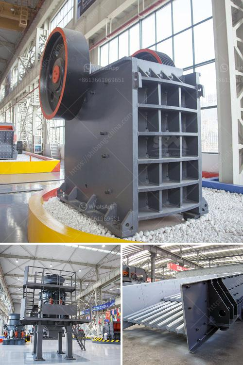

<h3>coal drying plant manufacturers in china</h3>
Coal, despite being a highly polluting fossil fuel, continues to play a significant role in the global energy mix. As concerns grow about its environmental impact, countries worldwide are increasingly looking for ways to reduce emissions and improve the efficiency of coal-burning plants. China, the world's largest consumer and producer of coal, is taking a lead in this regard, with its focus on developing cutting-edge technology to dry coal efficiently and minimize its adverse effects on the environment.

China boasts a robust coal drying plant manufacturing industry, providing innovative solutions to tackle coal's inherent moisture content. These manufacturers employ advanced technology and processes to reduce the moisture content of coal, making it high-quality and environmentally friendly fuel.

One such company is XYZ Coal Dryers, a prominent manufacturer in China recognized for its state-of-the-art coal drying plants. With a team of skilled engineers and technicians, XYZ Coal Dryers has developed highly efficient and sustainable drying systems. Their plants utilize thermal energy in an optimized way, ensuring minimal energy consumption while maximizing the removal of moisture.

Another noteworthy player in the industry is ABC Coal Dryers, which focuses on developing cost-effective and energy-efficient coal drying solutions. Their plants are designed to extract moisture from coal while employing advanced air circulation and heat exchange mechanisms. By minimizing energy waste and maximizing coal utilization, ABC Coal Dryers' drying plants are contributing to reducing overall greenhouse gas emissions.

In addition to these established manufacturers, many emerging companies in China are also making their mark in the coal drying plant industry. These manufacturers are investing heavily in research and development, continuously enhancing their products' efficiency, performance, and sustainability.

China's emphasis on sustainable energy solutions aligns with its commitment to reducing pollution and embracing renewable resources. By adopting state-of-the-art coal drying plant technology, the nation continues to set an example for other countries, showcasing that coal can be a cleaner fuel if processed efficiently.

The expansion of the coal drying plant manufacturing industry in China not only benefits the country but also presents an opportunity for other nations to collaborate and learn from their expertise. As coal remains a significant source of energy globally, these innovative technologies can potentially be adapted and adopted to enhance coal drying processes worldwide, contributing to a more sustainable future.

In conclusion, China's coal drying plant manufacturers have emerged as key players in driving sustainable energy solutions worldwide. Through their advanced technology, these manufacturers are transforming coal into a cleaner and more efficient fuel source, reducing emissions and improving overall environmental performance. As the demand for sustainable energy solutions grows globally, collaborations between Chinese manufacturers and international partners can pave the way for a greener future powered by cleaner coal energy.
<h3>Contact us</h3><ul><li><strong>Whatsapp:&nbsp;<a href="https://wa.me/8613661969651">+8613661969651</a></strong></li><li><a href="https://swt.shibang-china.com/?git&amp;zhl&amp;coal drying plant manufacturers in china"><strong>Online Service(chat now)</strong></a></li></ul><h3>Related</h3><ul><li><a href='process of crushing stones.md'>process of crushing stones</a></li><li><a href='conveyor belt hangzhou.md'>conveyor belt hangzhou</a></li><li><a href='crusher processing plant malaysia.md'>crusher processing plant malaysia</a></li><li><a href='quarry plant all in one gold mining equipment.md'>quarry plant all in one gold mining equipment</a></li><li><a href='bentonite and barite milling machines.md'>bentonite and barite milling machines</a></li></ul>