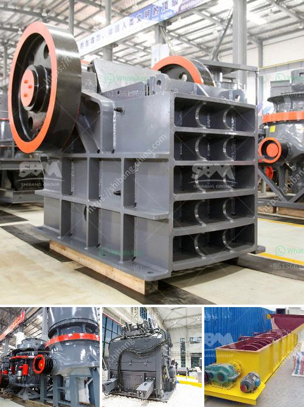

<h3>coal hammer mill capacity power</h3>
Whether it is in the power, mining, metallurgy, or chemical industry, coal plays an important role in the production process. As the most abundant fossil fuel on earth, coal is a vital resource for power generation. With the continuous expansion of the global energy demand, the need for efficient and reliable coal power has become more important than ever. 

One of the key equipment in a coal-fired power plant is the coal hammer mill. This equipment grinds coal into a fine powder, which is then used as fuel in the boilers. The coal hammer mill has a high capacity, making it suitable for large scale power plants. 

The coal hammer mill is a specialized machine specifically designed for crushing coal into smaller pieces. It adopts high-speed rotating hammers to crush the coal, resulting in a finer product size with fewer impurities. The coal hammer mill capacity power is determined by factors such as feed rate, rotor speed, and clearance between the grinding plates. 

The feed rate is influenced by the size and hardness of the coal. A higher feed rate allows for more coal to be processed per unit of time, thus increasing the mill's capacity. However, the size and hardness of the coal should be within the design limits of the mill to prevent excessive wear and damage to the equipment. 

The rotor speed plays a crucial role in determining the grinding efficiency of the coal hammer mill. A higher rotor speed enables the hammers to strike the coal with more force, resulting in a finer product size. However, a higher rotor speed also increases the power consumption of the mill. Thus, a balance needs to be struck between the desired product size and the power consumption. 

The clearance between the grinding plates is another important factor that affects the mill's capacity and power. A smaller clearance allows for finer grinding, but it also increases the risk of clogging and reduces the mill's throughput. On the other hand, a larger clearance reduces the risk of clogging but may result in a coarser product. Thus, the clearance needs to be optimized to achieve the desired product size while maintaining the mill's capacity. 

In conclusion, the coal hammer mill is a crucial equipment in coal-fired power plants. It has a high capacity, enabling large scale coal processing. The capacity and power of the mill are influenced by factors such as feed rate, rotor speed, and clearance between the grinding plates. These factors need to be carefully optimized to achieve the desired product size while maintaining the mill's capacity and power efficiency. With the continuous advancements in technology, the coal hammer mill is expected to become even more efficient and reliable in the years to come.
<h3>Contact us</h3><ul><li><strong>Whatsapp:&nbsp;<a href="https://wa.me/8613661969651">+8613661969651</a></strong></li><li><a href="https://swt.shibang-china.com/?git&amp;zhl&amp;coal hammer mill capacity power"><strong>Online Service(chat now)</strong></a></li></ul><h3>Related</h3><ul><li><a href='used stone crusher for sale in usa.md'>used stone crusher for sale in usa</a></li><li><a href='estimasi biaya usaha stone crusher.md'>estimasi biaya usaha stone crusher</a></li><li><a href='stone crushing plant manufacturers.md'>stone crushing plant manufacturers</a></li><li><a href='transmission for ball mill.md'>transmission for ball mill</a></li><li><a href='grinding machine manufacturers and suppliers in india.md'>grinding machine manufacturers and suppliers in india</a></li></ul>