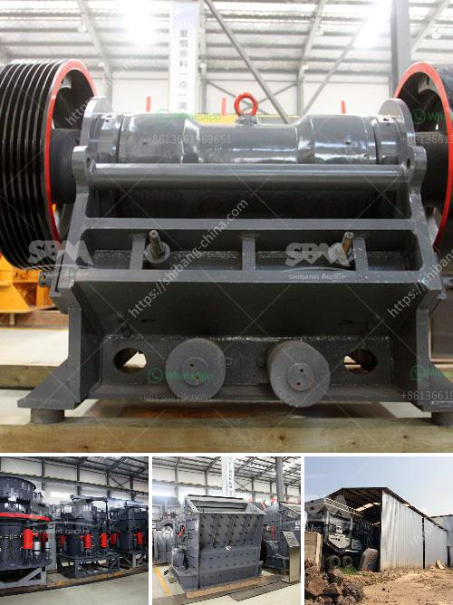

<h3>coal mill company in srilanka</h3>
With the increasing demand for sustainable energy sources, the coal industry has undergone significant transformation. In Sri Lanka, a prominent player in this domain is the innovative coal mill company, which has been carving a niche for itself in the energy sector. Their commitment towards renewable energy solutions and dedication to reducing carbon emissions have earned them a distinguished reputation among both domestic and international clients.

This coal mill company boasts state-of-the-art machinery and an impressive infrastructure. Their advanced coal milling technology has enabled them to produce high-quality coal powder that is not only eco-friendly but also performs efficiently. Equipped with modern machinery and expertise, the company stands out for its ability to meet the diverse energy requirements of businesses across various sectors.

One of the unique selling points of this coal mill company is its unwavering commitment to environmental sustainability. Aware of the detrimental impacts of coal mining, they have adopted stringent measures to ensure responsible mining practices. They strive to minimize carbon emissions and reduce the ecological footprint associated with coal milling. Additionally, through continuous research and development, they are actively exploring alternative technologies to further minimize their impact on the environment.

The company's success can be attributed to its focus on delivering exceptional customer service and satisfaction. By understanding the specific needs of each client, they offer tailored solutions that optimize energy consumption and performance. Their dedication to timely delivery, competitive pricing, and personalized after-sales support has gained them a strong and loyal customer base. The strong word-of-mouth reputation they have built is a testament to their commitment to excellence.

As the demand for sustainable energy sources continues to grow, coal mill companies play a vital role in facilitating an environmentally responsible transition. The coal mill company in Sri Lanka stands out as a pioneering force in the industry, combining cutting-edge technology, environmental sustainability, and commitment to customer satisfaction. With their impressive track record, they are poised to contribute significantly to Sri Lanka's energy landscape and drive economic growth in a sustainable manner.
<h3>Contact us</h3><ul><li><strong>Whatsapp:&nbsp;<a href="https://wa.me/8613661969651">+8613661969651</a></strong></li><li><a href="https://swt.shibang-china.com/?git&amp;zhl&amp;coal mill company in srilanka"><strong>Online Service(chat now)</strong></a></li></ul><h3>Related</h3><ul><li><a href='used jaw mobile crusher in uae.md'>used jaw mobile crusher in uae</a></li><li><a href='used gold mill for sale south africa.md'>used gold mill for sale south africa</a></li><li><a href='gypsum manufacturing equipment.md'>gypsum manufacturing equipment</a></li><li><a href='conveyor belts kenya.md'>conveyor belts kenya</a></li><li><a href='stone crusher plant video.md'>stone crusher plant video</a></li></ul>