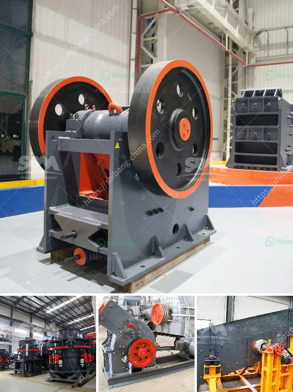

<h3>coal mill grinding roller</h3>
The coal mill grinding roller is an important component of the coal mill. It is designed to grind and crush coal into coal powder, cement, or coal combustion products. It is widely used in the cement industry, thermal power plant, metallurgy industry, chemical industry, etc.

Due to the strict requirements of coal mill operation, the grinding roller needs to have sufficient hardness and good wear resistance. The material of the grinding roller is usually made of alloy steel, high chromium cast iron, or nickel-chromium alloy. These materials have good toughness, high-temperature resistance, wear resistance, and excellent mechanical properties.

The grinding roller is equipped with a spring pressure device, which provides a certain grinding pressure to the coal mill to increase the grinding efficiency. The grinding roller is also equipped with a hydraulic accumulator to ensure stable operation of the coal mill and prevent overload.

During the coal mill operation, the grinding roller will gradually wear out due to continuous friction and impact. Therefore, regular maintenance and replacement of the grinding roller are necessary. The replacement frequency depends on the coal mill's operating conditions and the grinding roller's material and quality.

To ensure the coal mill's efficient and stable operation, it is crucial to choose a reliable and reputable supplier for the grinding roller. A reputable supplier will provide high-quality grinding rollers with appropriate hardness, good wear resistance, and reliable performance.

In conclusion, the coal mill grinding roller plays a vital role in the coal mill's operation. It must have good hardness, wear resistance, and reliable performance to ensure the coal mill's efficient and stable operation. Regular maintenance and replacement of the grinding roller are necessary to extend its service life and prevent unexpected shutdowns. Therefore, choosing a reputable supplier for the grinding roller is of utmost importance for the coal mill's smooth operation.
<h3>Contact us</h3><ul><li><strong>Whatsapp:&nbsp;<a href="https://wa.me/8613661969651">+8613661969651</a></strong></li><li><a href="https://swt.shibang-china.com/?git&amp;zhl&amp;coal mill grinding roller"><strong>Online Service(chat now)</strong></a></li></ul><h3>Related</h3><ul><li><a href='ballast crushing project.md'>ballast crushing project</a></li><li><a href='mobile crusher morocco price.md'>mobile crusher morocco price</a></li><li><a href='gypsum board manufacturing process.md'>gypsum board manufacturing process</a></li><li><a href='alluvial gold mining machines.md'>alluvial gold mining machines</a></li><li><a href='500mm vertical mill stones price.md'>500mm vertical mill stones price</a></li></ul>