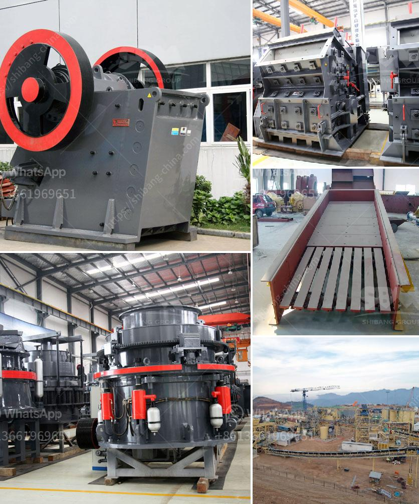

<h3>coal mill price 5 tph</h3>
Coal mills are used to pulverize and dry the coal before it is blown into the power plant furnace to ensure efficient combustion. Nowadays, with the ever-increasing demand for energy, coal-fired power plants are in constant need of reliable and cost-effective coal mills. In this article, we will discuss the price factors of a coal mill with a capacity of 5 TPH.

Firstly, it is essential to understand that the price of a coal mill is influenced by various factors. The primary factor is the technology used in the manufacturing process. The more advanced and efficient the technology, the higher the price of the mill. Additionally, the size and capacity of the mill also play a significant role in determining its price. A 5 TPH mill would generally cost more than a smaller capacity mill.

Furthermore, the quality and durability of the mill also impact its price. A higher-quality mill with better materials and construction will have a higher price tag, but it will also provide longer service life and better performance, making it a more economical choice in the long run. On the other hand, a cheaper mill may save you money initially but might require frequent repairs and replacements, resulting in higher maintenance costs over time.

Moreover, the brand reputation and customer service offered by the manufacturer also influence the price. Well-established and reputable brands often charge a premium for their mills due to the trust and reliability associated with their products. Additionally, superior customer service, including technical support and after-sales service, can add value to the mill and justify a higher price.

It is important to note that coal mills are integral components of power plants, and any downtime or malfunction can lead to significant financial losses. Therefore, investing in a reliable and high-quality mill can contribute to the overall efficiency and profitability of the power plant.

Now let's consider a specific scenario of a coal mill with a capacity of 5 TPH. The price range for such a mill can vary between $50,000 and $100,000, depending on the factors mentioned above. However, it is crucial to conduct a comparative analysis before making a purchase decision.

Researching and comparing quotes from different manufacturers will allow you to assess the cost-benefit ratio. Consider the aforementioned factors, such as technology, size, quality, brand reputation, and customer service, while comparing prices. Additionally, be sure to evaluate the warranty and maintenance terms offered by each manufacturer.

In conclusion, the price of a coal mill with a capacity of 5 TPH can be influenced by several factors, including technology, size, quality, brand reputation, and customer service. Conducting a comparative analysis and evaluating the cost-benefit ratio is essential before making a purchase decision. Remember to prioritize reliability, efficiency, and long-term performance over a lower initial price, as this will ultimately contribute to the success of your power plant operation.
<h3>Contact us</h3><ul><li><strong>Whatsapp:&nbsp;<a href="https://wa.me/8613661969651">+8613661969651</a></strong></li><li><a href="https://swt.shibang-china.com/?git&amp;zhl&amp;coal mill price 5 tph"><strong>Online Service(chat now)</strong></a></li></ul><h3>Related</h3><ul><li><a href='cost of graphite processing plant.md'>cost of graphite processing plant</a></li><li><a href='aggregate quarries crusher in thailand.md'>aggregate quarries crusher in thailand</a></li><li><a href='mobile crushing plant price.md'>mobile crushing plant price</a></li><li><a href='vibrating screens for material crusher.md'>vibrating screens for material crusher</a></li><li><a href='pfw impact crusher.md'>pfw impact crusher</a></li></ul>