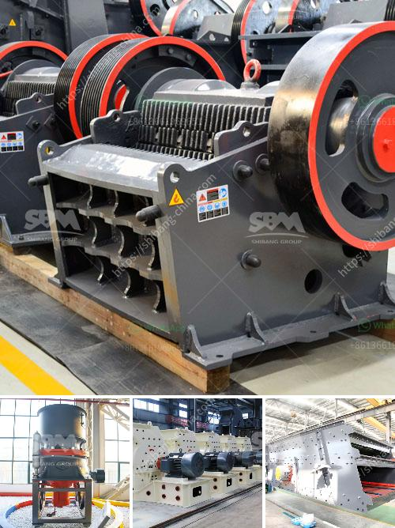

<h3>coal mine wash plants mpumalanga south africa</h3>
Mpumalanga, a province in South Africa, is known for its significant coal deposits and is a major contributor to the country's power generation. With vast coal reserves, the region plays a crucial role in meeting South Africa's energy needs. However, the extraction and processing of coal generate large amounts of waste materials, including rock, soil, and water, which need to be efficiently managed. To ensure sustainable and responsible coal mining practices, coal mine wash plants have been established in Mpumalanga.

Coal mine wash plants, also known as beneficiation plants, are facilities designed to clean impurities from coal before it is transported to power plants or other industrial consumers. The main purpose of these plants is to improve the quality of the coal and reduce its environmental impact by removing harmful contaminants and impurities.

The process begins with the extraction of coal from the mine, usually through open-pit or underground mining methods. After the coal is extracted, it is transported to the wash plant for processing. At the wash plant, various techniques are employed to separate the coal from the unwanted materials.

One of the primary methods used in coal wash plants is dense medium separation (DMS), which involves the separation of coal from waste materials based on their specific gravity. In this process, a mixture of water and a dense medium, such as magnetite or ferrosilicon, is used to create a liquid of certain density. The coal, which has a lower density, floats on top of the liquid, while the denser waste materials sink to the bottom. The clean coal is then separated and dried for transportation.

In addition to DMS, coal mine wash plants may also incorporate other processes such as crushing and screening, centrifuges, flotation, and magnetic separation to further refine the coal and remove impurities. These technologies help to improve the quality, calorific value, and efficiency of the coal, making it suitable for various industrial applications.

The use of coal mine wash plants in Mpumalanga has several significant benefits. Firstly, it ensures that only coal of high quality is supplied to power plants, resulting in more efficient and cleaner combustion processes. This, in turn, reduces harmful emissions, including greenhouse gases, and improves overall air quality.

Secondly, coal wash plants help to mitigate the environmental impact caused by coal mining activities. Through the removal of waste materials, the plants minimize the amount of land required for waste disposal and prevent contamination of local ecosystems, including rivers and underground water sources.

Furthermore, coal mine wash plants provide valuable by-products, such as magnetite, which can be used in other industrial processes. This creates additional economic opportunities and reduces waste generation.

In conclusion, coal mine wash plants in Mpumalanga, South Africa, are essential for ensuring the sustainable and responsible extraction and processing of coal. By removing impurities and waste materials, these plants improve the quality of coal, reduce environmental impacts, and create economic opportunities. The establishment of coal wash plants demonstrates the commitment of Mpumalanga to responsible mining practices and contributes to South Africa's energy security.
<h3>Contact us</h3><ul><li><strong>Whatsapp:&nbsp;<a href="https://wa.me/8613661969651">+8613661969651</a></strong></li><li><a href="https://swt.shibang-china.com/?git&amp;zhl&amp;coal mine wash plants mpumalanga south africa"><strong>Online Service(chat now)</strong></a></li></ul><h3>Related</h3><ul><li><a href='used portable crushing plant for sale philippines.md'>used portable crushing plant for sale philippines</a></li><li><a href='dry process of cement.md'>dry process of cement</a></li><li><a href='stone crushing plant price list.md'>stone crushing plant price list</a></li><li><a href='process of making diamonds from coal.md'>process of making diamonds from coal</a></li><li><a href='how to crusher granite.md'>how to crusher granite</a></li></ul>