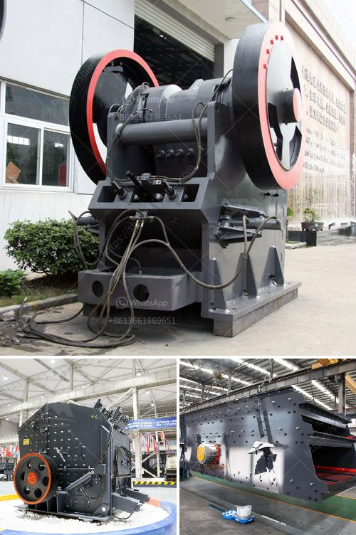

<h3>coal mining machines in south africa</h3>
South Africa is one of the top five coal exporting countries worldwide. Almost one-quarter of the coal mined in the country is exported, primarily through the Richards Bay Coal Terminal, making South Africa the fourth-largest coal exporting country globally.

Despite the declining coal industry, South Africa continues to rely heavily on coal for electricity generation. Eskom, the national power company, reportedly consumes approximately 120 million tons of coal annually, resulting in the need for more efficient coal mining machines. This article provides an overview of the leading coal mining equipment suppliers in South Africa.

Kevcor is a well-established coal mining equipment supplier based in Johannesburg, South Africa. Their equipment is renowned for its durability and reliability in the challenging South African mining environment. From mechanical loaders to conveyors, Kevcor supplies a wide range of underground coal mining machinery. Their machines are designed to improve safety and productivity while minimizing environmental impact.

Bell Equipment is a leading manufacturer and supplier of mining vehicles and machinery in South Africa. Their comprehensive range of equipment caters to various mining operations, including coal mining. The company provides a range of specialized machines specifically designed for the unique challenges of coal mining operations. These include loaders, dump trucks, and utility vehicles that enhance productivity and reduce downtime.

Sandvik is a global leader in mining equipment manufacturing, with a strong presence in South Africa. The company offers a comprehensive range of cutting-edge coal mining machinery, including hydraulic roof supports, cutting machines, continuous miners, and roadheaders. Sandvik's equipment aims to increase efficiency and safety in coal mining operations while reducing environmental impact.

Joy Global, now part of Komatsu Mining Corporation, is a renowned manufacturer of mining machinery and equipment. The company offers a wide range of high-quality equipment for various mining applications, including coal mining. Joy Global's coal mining equipment is known for its exceptional reliability and performance. Their machines are designed to extract coal with maximum productivity while minimizing operational costs.

Deilmann-Haniel Mining Systems (DHMS) is a leading German manufacturer of mining machinery and equipment. The company has a significant presence in South Africa with various mining equipment and services offered. DHMS supplies high-quality longwall systems, continuous miners, and other coal mining machinery. Their equipment is known for its durability, performance, and advanced automation capabilities.

In conclusion, South Africa's coal mining machinery plays a crucial role in the country's coal industry. With the declining coal sector and increasing reliance on renewable energy, the need for efficient and environmentally friendly coal mining machines has become more important than ever. The aforementioned suppliers offer a range of cutting-edge equipment that enhances safety, productivity, and sustainability in South Africa's coal mining operations. As the country navigates its energy transition, these suppliers provide the necessary tools for the coal industry to operate efficiently and responsibly in the years to come.
<h3>Contact us</h3><ul><li><strong>Whatsapp:&nbsp;<a href="https://wa.me/8613661969651">+8613661969651</a></strong></li><li><a href="https://swt.shibang-china.com/?git&amp;zhl&amp;coal mining machines in south africa"><strong>Online Service(chat now)</strong></a></li></ul><h3>Related</h3><ul><li><a href='crushing machines of compostable material.md'>crushing machines of compostable material</a></li><li><a href='materials used to make a talcum powder.md'>materials used to make a talcum powder</a></li><li><a href='gypsum making machine.md'>gypsum making machine</a></li><li><a href='slag crushing machine hopper in india.md'>slag crushing machine hopper in india</a></li><li><a href='ton crushing machine.md'>ton crushing machine</a></li></ul>