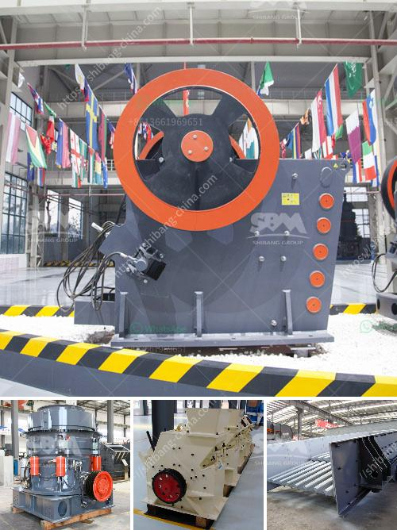

<h3>coal pulverizer crusher manufacturers in india</h3>
Coal is an essential resource in India, as it fuels around 60% of the nation's electricity production. More than 70% of India's electricity is currently generated from coal-fired power plants. Therefore, the continuous supply of coal is vital to meet the ever-increasing energy demands of the country. A crucial piece of equipment in the coal power generation process is the coal pulverizer crusher.

Coal pulverizers play an essential role in the functioning and performance of a coal-fired power plant. The main function of the coal pulverizer crusher is to crush the coal and transport it to the furnace for burning. The pulverizer crusher manufacturers in India are increasingly growing, as coal-fired power plants are retiring at an alarming rate due to environmental concerns.

The pulverizer crusher manufacturers in India strive to provide the technologically advanced crushing equipment to meet the diverse requirements of coal crushing. They are committed to enhancing the efficiency of coal pulverizers and crushers through the continuous research and development of innovative technologies.

One of the leading coal pulverizer crusher manufacturers in India is Shree Techno Engineers. They have been able to develop machines that can efficiently crush coal to the desired size with the desired fineness. These machines are designed using high-quality materials and advanced technology to ensure maximum performance and durability.

Shree Techno Engineers' coal pulverizer crushers are available in various models, such as hammer crusher, impact crusher, and jaw crusher. These machines can efficiently crush coal into different sizes as per the specific requirements of the power plant. The crushers are designed to ensure minimal dust generation during the crushing process, which is essential for maintaining a clean and healthy working environment.

Another prominent coal pulverizer crusher manufacturer in India is BHEL. The company focuses on providing state-of-the-art crushing equipment for coal-fired power plants. BHEL offers a comprehensive range of coal pulverizer crushers, including impact crushers, hammer mills, jaw crushers, and roller crushers. Their crushers are known for their high crushing efficiency, low maintenance requirements, and long service life.

To ensure reliable and continuous power generation, coal pulverizer crusher manufacturers in India are also investing in research and development activities to improve the performance and efficiency of their machines. They are constantly exploring new technologies and innovative solutions to boost the productivity and reliability of coal crushers.

In conclusion, the coal pulverizer crusher manufacturers in India play a crucial role in the coal power generation process. They provide technologically advanced crushing equipment that efficiently crushes the coal and transports it for burning in the furnace. With a focus on research and development, these manufacturers are continuously improving the efficiency and performance of their crushers to meet the evolving needs of coal-fired power plants.
<h3>Contact us</h3><ul><li><strong>Whatsapp:&nbsp;<a href="https://wa.me/8613661969651">+8613661969651</a></strong></li><li><a href="https://swt.shibang-china.com/?git&amp;zhl&amp;coal pulverizer crusher manufacturers in india"><strong>Online Service(chat now)</strong></a></li></ul><h3>Related</h3><ul><li><a href='mining equipment companies in nigeria.md'>mining equipment companies in nigeria</a></li><li><a href='ball mill ball mill.md'>ball mill ball mill</a></li><li><a href='used sand wash plant for sale in texas.md'>used sand wash plant for sale in texas</a></li><li><a href='alluvial gold mining machines.md'>alluvial gold mining machines</a></li><li><a href='process of mining silica rock crusher.md'>process of mining silica rock crusher</a></li></ul>