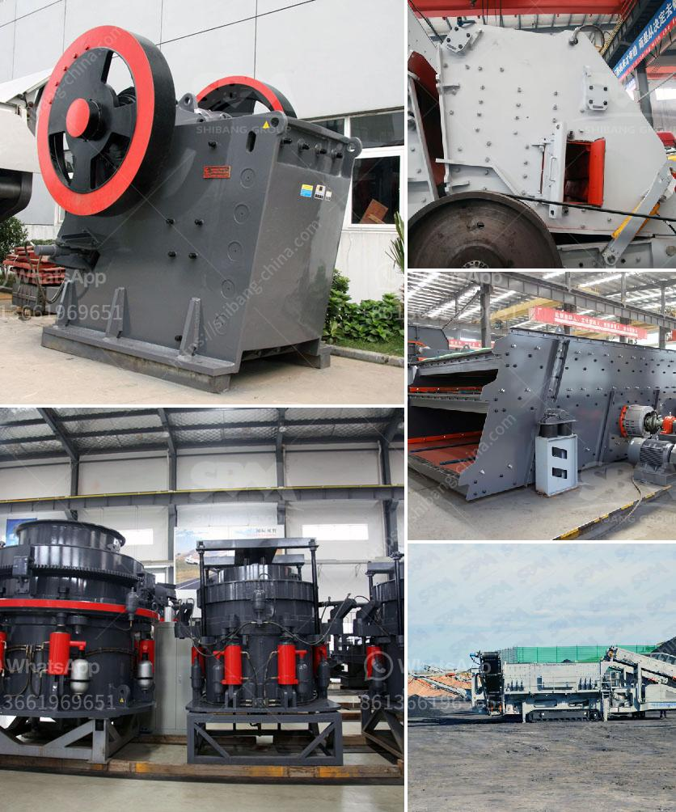

<h3>coal roller mill</h3>
A coal roller mill, also known as a coal pulverizer, grinds coal into fine particles that can be used as fuel in various applications. This device consists of a rotating grinding table and a set of rollers or balls, which pulverize the coal as it falls between them. The coal particles are then swept upward by hot air, carried via an air stream in the coal mill, and conveyed to a boiler for combustion.

One of the primary advantages of using a coal roller mill is its ability to grind the coal to a desired fineness, ensuring efficient combustion. By grinding the coal to finer particles, its surface area is increased, thus enabling better combustion and heat transfer. This results in improved boiler efficiency, reduced emissions, and overall energy savings.

Another advantage of using a coal roller mill is its flexibility in handling a wide variety of coal types, from low-rank lignite to high-rank bituminous coal. This makes it a versatile option for coal-fired power plants, which often need to burn different types of coal depending on availability and cost.

In addition to its role in coal combustion, a coal roller mill can also be used for drying and grinding other materials, such as limestone, cement clinker, or gypsum. This further enhances its value and utility in various industries.

However, it is important to note that coal roller mills require regular maintenance and monitoring to ensure optimal performance. Wear and tear of grinding components and the need for periodic replacement can increase operational costs. Additionally, coal roller mills can generate fine coal dust, which may pose a health and safety hazard if not properly managed.

In conclusion, a coal roller mill is an essential piece of equipment for coal-fired power plants and various industries that utilize coal as a fuel source. Its ability to grind coal to a desired fineness ensures efficient combustion and improved boiler performance. Despite some challenges related to maintenance and dust management, the benefits of using a coal roller mill outweigh the drawbacks, making it a valuable tool in the energy and manufacturing sectors.
<h3>Contact us</h3><ul><li><strong>Whatsapp:&nbsp;<a href="https://wa.me/8613661969651">+8613661969651</a></strong></li><li><a href="https://swt.shibang-china.com/?git&amp;zhl&amp;coal roller mill"><strong>Online Service(chat now)</strong></a></li></ul><h3>Related</h3><ul><li><a href='continuous ball mill capacity 500 hr.md'>continuous ball mill capacity 500 hr</a></li><li><a href='china henan machinery small ball mill.md'>china henan machinery small ball mill</a></li><li><a href='china coal mill grinder manufacturers china.md'>china coal mill grinder manufacturers china</a></li><li><a href='list of price of stone crusher machine in zimbabwe.md'>list of price of stone crusher machine in zimbabwe</a></li><li><a href='graphite mine slurry ball mill.md'>graphite mine slurry ball mill</a></li></ul>