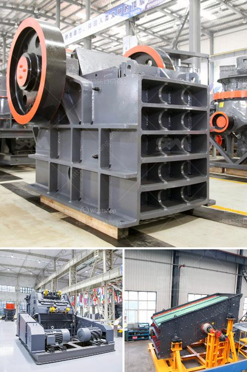

<h3>coal washing equipment</h3>
Coal is a vital resource for energy generation and plays a crucial role in many industries worldwide. However, before it can be used, coal must go through a process called coal washing, which removes impurities and minerals, making it cleaner and more efficient for use.

Coal washing equipment refers to a range of machinery used in the process of separating impurities from raw coal. It is often used in conjunction with a coal preparation plant, where coal is crushed, screened, and sorted according to size and quality. The equipment can include screens, centrifuges, or hydrocyclones, depending on the objective of the washing process.

One of the primary objectives of coal washing is to reduce the ash content of coal, as ash provides no calorific value and contributes to environmental pollution during combustion. By efficiently removing ash from coal, the overall energy value of the coal is increased, resulting in higher combustion efficiency and reduced emissions.

Another key objective of coal washing is to remove sulfur-bearing minerals, such as pyrite (FeS2), which are a major source of sulfur dioxide (SO2) emissions. Acid rain, caused by SO2 emissions mixing with atmospheric moisture, poses a significant environmental threat. Therefore, coal washing equipment plays a critical role in minimizing sulfur emissions and contributing to cleaner air quality.

Coal washing equipment also helps minimize other mineral impurities that can affect the quality and efficiency of the coal. These impurities can include clay, shale, rocks, and other minerals found in the coal seam. Removing these impurities improves the overall coal quality and ensures a more consistent and reliable fuel source for power plants and other users.

There are various types of coal washing equipment available, each designed for specific applications. Screens are commonly used to size the coal and remove larger impurities. They can be stationary or vibrating and are often equipped with water sprays to aid in the washing process.

Centrifuges are another type of coal washing equipment that relies on mechanical separation based on size and density differences. They are effective in removing finer impurities such as clay and shale, which can be challenging to remove with screens alone.

Hydrocyclones are also commonly used in coal washing. These devices use the principle of centrifugal separation to separate small particles from water. Hydrocyclones are particularly effective in removing fine particles such as sand and silt from the coal.

In conclusion, coal washing equipment is essential in the coal preparation process to remove impurities and minerals, resulting in cleaner and more efficient coal. Through the removal of impurities such as ash, sulfur, and other minerals, coal washing equipment contributes to improved combustion efficiency, reduced emissions, and a cleaner environment. With various types of equipment available, coal washing can be tailored to specific requirements, ensuring the production of high-quality coal for energy generation and industrial applications.
<h3>Contact us</h3><ul><li><strong>Whatsapp:&nbsp;<a href="https://wa.me/8613661969651">+8613661969651</a></strong></li><li><a href="https://swt.shibang-china.com/?git&amp;zhl&amp;coal washing equipment"><strong>Online Service(chat now)</strong></a></li></ul><h3>Related</h3><ul><li><a href='second hand mobile crusher plant.md'>second hand mobile crusher plant</a></li><li><a href='micron grinding manufacturer.md'>micron grinding manufacturer</a></li><li><a href='50 tpd cement plant cost in india.md'>50 tpd cement plant cost in india</a></li><li><a href='clinker grinding plant setup cost in india.md'>clinker grinding plant setup cost in india</a></li><li><a href='marble grinding machines factory in turkey.md'>marble grinding machines factory in turkey</a></li></ul>