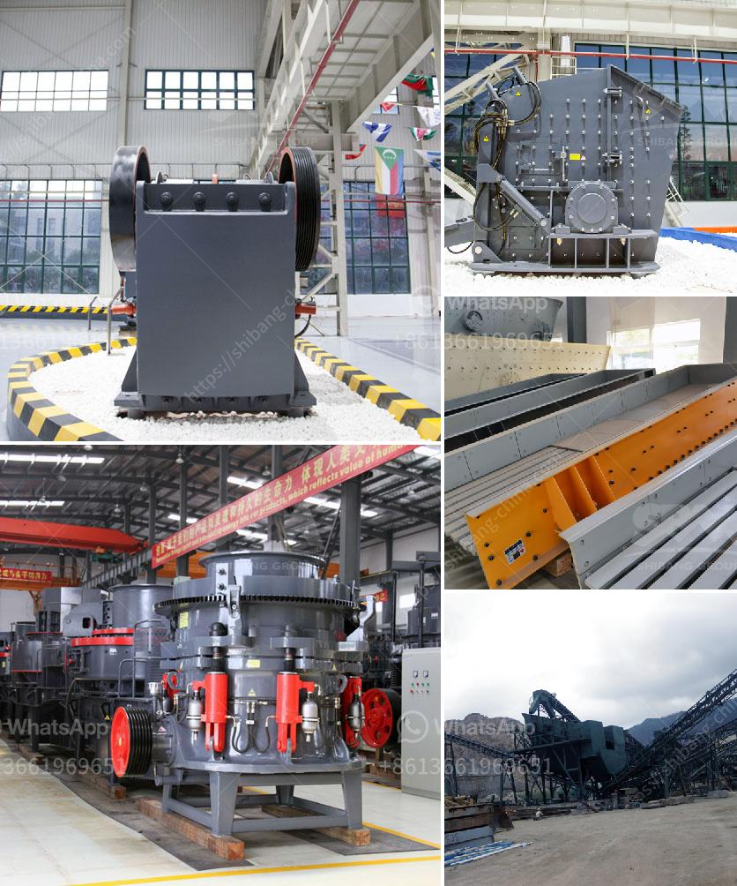

<h3>coal washing plant cost</h3>
A medium-sized coal washing plant is processing an annual capacity of 450,000 tons to 900,000 tons. High-efficiency concentrator for coal sludge dewatering The slime treatment of large coal washing plants mainly relies on equipment, such as thickeners and filter presses. However, most of the large ordinary thickeners are designed for the use of metallurgical mines, which have the disadvantages of large investment and low operation rate. Only a small number of coal mines use high-efficiency thickeners or tailings dry drainage system for sludge dewatering.

The thickener uses flocculants to increase the settling velocity of solid particles in the slurry. After the flocculants are added, a unique central feed system can effectively transfer and evenly distribute the flocculants to all areas of the thickener. Thus, increasing the settling speed and sedimentation efficiency of fine particles. In addition, the addition of CMC (carboxymethyl cellulose) flocculant can effectively prevent the re-expansion of the flocs during pressing or stacking, which greatly improves the dryness of the filter cake.

As for the filter press, the automatic filter press is highly efficient, energy-saving, and labor-saving. It adopts PLC control system and touchscreen operation interface, which realizes automatic control of feeding, filtering, and squeezing processes. The filter press has the characteristics of large processing capacity, high dehydration efficiency, and high solid content. The moisture content of the filter cake after pressing can reach 12%~15%.

The investment in coal washing plants will be relatively large, and some of the coal will be lost during the washing process. Especially after washing, a large amount of slime is produced. The water content of the slime is as high as 20%~40%, which significantly reduces the calorific value and increases transportation costs. Therefore, a coal washing plant is necessary to reduce the ash content and improve the coal quality.

The higher the ash content of coal, the lower the yield of coal and the higher the cost of coal preparation. Therefore, the coal washing process is a mature, highly efficient and scientific sorting method used in the treatment of coal mine. Overall, the cost of a coal washing plant mainly includes equipment investment, labor costs, and transportation costs.

1. Equipment selection: It is wise to choose a large and complex coal washing equipment with a high degree of automation, which can greatly reduce labor costs. The screen-type coal washing machine has large output and high efficiency, which effectively improves the sorting efficiency and reduces the investment of subsequent processes.

2. The quality of raw coal: Large coal washing plants use a laminated crushing system to maximize the size reduction of coal. For high ash coal, three products can be obtained by separating coarse coal, clean coal, and gangue, thus reducing the waste of resources.

3. The transportation distance: The transportation distance will directly affect the transportation costs of the washed coal. Therefore, the selection of the coal washing plant location should take into account the convenience of transportation.

In summary, coal washing plants are essential for improving coal quality and reducing transportation costs. The cost of a coal washing plant depends on various factors, including the equipment selection, the quality of raw coal, and the transportation distance. Investing in a coal washing plant can increase economic efficiency and create considerable profits.
<h3>Contact us</h3><ul><li><strong>Whatsapp:&nbsp;<a href="https://wa.me/8613661969651">+8613661969651</a></strong></li><li><a href="https://swt.shibang-china.com/?git&amp;zhl&amp;coal washing plant cost"><strong>Online Service(chat now)</strong></a></li></ul><h3>Related</h3><ul><li><a href='cost of crusher run in las vegas.md'>cost of crusher run in las vegas</a></li><li><a href='ore beneficiation equipment suppliers china.md'>ore beneficiation equipment suppliers china</a></li><li><a href='allis chalmers 54 x 74 gyratory crusher.md'>allis chalmers 54 x 74 gyratory crusher</a></li><li><a href='gold mining equipment suppliers.md'>gold mining equipment suppliers</a></li><li><a href='barite powder manufacturing machinery.md'>barite powder manufacturing machinery</a></li></ul>