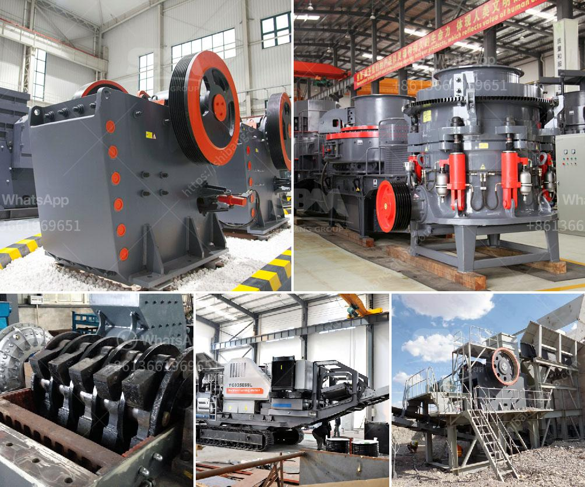

<h3>coal washing plant drawing</h3>
Coal washing is an essential process for extracting clean coal from raw coal. Coal washing plants, also known as coal preparation plants, are facilities designed to process coal before it is used in power stations to generate electricity. The washing process involves removing impurities, such as rocks, clay, and other minerals, creating a more valuable product.

One of the crucial components of a coal washing plant is the drawing, which defines the construction layout and operational processes of the plant. The drawing serves as a blueprint that guides engineers and technicians during the construction and maintenance of the plant.

The primary purpose of the drawing is to outline the equipment and infrastructure required for coal washing. This includes screens, crushers, cyclones, and dense medium vessels, among other components. The drawing shows the exact location and arrangement of these elements, ensuring efficient coal processing.

In addition to the equipment, the drawing also includes detailed information about the piping, electrical wiring, and control systems necessary for the plant's operation. This information allows engineers to understand how different sections of the plant are interconnected and how they function together.

The drawing of a coal washing plant typically consists of several sheets, with each sheet focusing on a different aspect of the plant's design. For example, one sheet may illustrate the overall layout of the plant, including the positioning of buildings, roads, and stockpiles. Another sheet may showcase the equipment arrangement in a specific section, such as the coal crushing and screening area.

Drawing a coal washing plant requires expertise in engineering, as well as a deep understanding of the coal washing process. It is essential to consider various factors, such as the throughput capacity, the coal quality, and the desired final product specifications, when creating the drawing. These considerations ensure that the plant is optimized for efficient coal washing and meets the specific requirements of the coal being processed.

With the help of advanced computer-aided design (CAD) software, engineers can develop highly accurate and intricate drawings for coal washing plants. CAD software allows for precise measurements, 3D modeling, and simulation, which aid in visualizing the plant's design and identifying potential issues.

Coal washing plants play a vital role in ensuring the quality of coal used for power generation. By removing impurities, the plants enhance the heating value and reduce the environmental impact of burning coal. Additionally, clean coal produced from washing plants improves combustion efficiency and reduces emissions of harmful pollutants.

In summary, a coal washing plant drawing is a detailed blueprint that outlines the construction layout and operational processes of a coal washing facility. It includes information about equipment arrangement, infrastructure design, and control systems. The drawing serves as a valuable tool for engineers and technicians during the construction and maintenance of the plant, ultimately contributing to the production of high-quality, clean coal.
<h3>Contact us</h3><ul><li><strong>Whatsapp:&nbsp;<a href="https://wa.me/8613661969651">+8613661969651</a></strong></li><li><a href="https://swt.shibang-china.com/?git&amp;zhl&amp;coal washing plant drawing"><strong>Online Service(chat now)</strong></a></li></ul><h3>Related</h3><ul><li><a href='vertical mill price.md'>vertical mill price</a></li><li><a href='china coal mill grinder manufacturers china.md'>china coal mill grinder manufacturers china</a></li><li><a href='how much complete cost for iron ore crasher plants setup.md'>how much complete cost for iron ore crasher plants setup</a></li><li><a href='functions of the part of a hammer mill.md'>functions of the part of a hammer mill</a></li><li><a href='industrial crushing machines.md'>industrial crushing machines</a></li></ul>