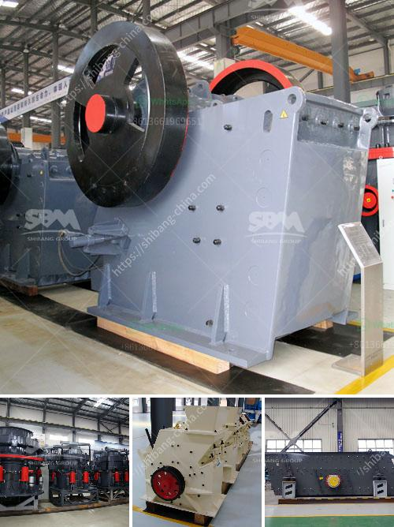

<h3>coal washing plant in pakistan</h3>
Coal is a cheap and abundant source of energy in many developing countries, including Pakistan. However, despite its abundance, Pakistan has not utilized its coal reserves to their fullest potential due to lack of infrastructure and technology for coal mining and power generation. One such crucial infrastructure is a coal washing plant, which can efficiently remove impurities from coal and improve its quality.

Coal washing involves using water and other chemical agents to remove pollutants and impurities from raw coal. This process not only improves the heating value of coal but also reduces its harmful emissions when used in power plants. Unfortunately, Pakistan has largely overlooked this crucial step in the coal mining process, resulting in poor quality coal being burned in power stations, leading to environmental damage and health problems.

The establishment of a coal washing plant in Pakistan would not only create job opportunities but also prove beneficial to the environment. A recent study by the Pakistan Environmental Protection Agency (EPA) revealed that coal-washing plants in Pakistan are emitting excessive quantities of fine particles (PM2.5) and harmful gases, including mercury, arsenic, and sulfur dioxide. These pollutants have severe long-term health impacts, including respiratory diseases, cardiovascular problems, and even cancer.

By implementing coal washing plants, Pakistan can significantly reduce the emission of these harmful pollutants, making its coal-fired power plants cleaner and more environmentally friendly. Washing coal can also help Pakistan utilize its vast coal reserves more efficiently, as high-quality coal can be used directly in power generation, resulting in increased efficiency and reduced greenhouse gas emissions.

Furthermore, coal washing plants can help Pakistan meet its international commitments to reduce carbon emissions. As a signatory to the Paris Agreement, Pakistan has pledged to reduce its greenhouse gas emissions by 20% by 2030. By improving the quality of its coal through washing, Pakistan can align itself with international standards and demonstrate its commitment to a greener and sustainable future.

The establishment of coal washing plants in Pakistan would require investment in infrastructure and advanced technology. However, the benefits far outweigh the costs. Not only would it improve the quality of coal, but it would also lead to a reduction in environmental pollution, improving the overall health and well-being of the population living near coal-fired power plants.

Moreover, the establishment of coal washing plants would create employment opportunities for the local population. From skilled workers to engineers and technicians, these plants would require a diverse range of expertise, thus helping to alleviate poverty and improve living standards in the region.

In conclusion, a coal washing plant in Pakistan is an important step towards utilizing coal more efficiently, reducing its harmful emissions, and meeting international commitments to combat climate change. By investing in infrastructure and advanced technology, Pakistan can maximize the potential of its coal reserves and create a cleaner and more sustainable future.
<h3>Contact us</h3><ul><li><strong>Whatsapp:&nbsp;<a href="https://wa.me/8613661969651">+8613661969651</a></strong></li><li><a href="https://swt.shibang-china.com/?git&amp;zhl&amp;coal washing plant in pakistan"><strong>Online Service(chat now)</strong></a></li></ul><h3>Related</h3><ul><li><a href='price of stone crush machine in pakistan.md'>price of stone crush machine in pakistan</a></li><li><a href='list of quarry crusher company in the philippines.md'>list of quarry crusher company in the philippines</a></li><li><a href='stone crusher in cameroon.md'>stone crusher in cameroon</a></li><li><a href='mobile jaw crusher plant.md'>mobile jaw crusher plant</a></li><li><a href='kaolin mining crusher process.md'>kaolin mining crusher process</a></li></ul>