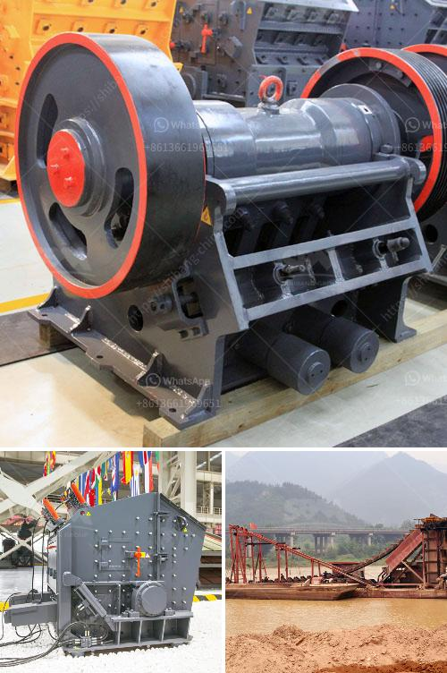

<h3>coal washing plants for rental in malaysia</h3>
Coal washing plants play a crucial role in Malaysia's energy sector. These plants help clean impurities from the raw coal before it is used as fuel in power stations and industries. As demand for energy continues to rise in Malaysia, the need for efficient coal washing plants for rental has become more pronounced.

Coal washing plants are essential for Malaysia as it heavily relies on coal to meet its energy needs. While the country has made significant progress in utilizing renewable energy sources, coal remains a crucial component of its energy mix. The use of coal helps ensure stable and affordable energy supply, especially during peak demand periods.

However, coal in its raw form contains impurities like rock, dust, sulfur, and other minerals. These impurities can cause significant damage to power plant equipment and release harmful emissions during combustion. Therefore, it is crucial to remove these impurities through the coal washing process.

Coal washing plants utilize different techniques to separate coal from impurities. The most common method is a dense medium separation process that uses a mixture of coal and water. The coal floats while the impurities sink. This process effectively removes impurities, allowing the clean coal to be used efficiently as fuel.

The rental of coal washing plants in Malaysia provides several benefits for the energy sector. Firstly, it allows power plant operators and industries to access state-of-the-art washing technology without committing to a long-term investment. This flexibility is particularly advantageous for smaller power stations or temporary industrial facilities that may not require a permanent coal washing plant.

Furthermore, renting coal washing plants helps reduce capital expenditure for power plant operators. Building and maintaining a coal washing plant can be a costly endeavor, requiring significant upfront investments. Renting the equipment allows operators to allocate their financial resources to other critical areas of plant operations.

Another advantage of rental coal washing plants is the ability to access professional expertise and technical support. Renting from reputable companies ensures that operators receive guidance on plant setup, operation, and maintenance. This support helps optimize plant performance, ensuring efficient coal processing and minimizing downtime.

Renting also offers the opportunity to easily upgrade or replace equipment as technology advances or operational needs change. Since coal washing technology continues to evolve, renting allows operators to stay at the forefront of advancements without significant investment risks.

The availability of coal washing plants for rental contributes to Malaysia's commitment to sustainable energy practices. By ensuring that coal is thoroughly cleaned before combustion, these plants help minimize environmental impact. Cleaner coal leads to reduced emissions of sulfur dioxide, nitrogen oxides, and particulate matter, contributing to improved air quality and public health.

In conclusion, coal washing plants for rental in Malaysia are crucial for the country's energy sector. These plants enable efficient coal processing, minimizing impurities and maximizing the use of coal as a reliable energy source. Renting coal washing plants offers flexibility, cost savings, access to professional expertise, and supports Malaysia's commitment to sustainable energy practices. As the demand for energy continues to grow, the availability of rental coal washing plants will play a vital role in meeting Malaysia's energy needs efficiently and responsibly.
<h3>Contact us</h3><ul><li><strong>Whatsapp:&nbsp;<a href="https://wa.me/8613661969651">+8613661969651</a></strong></li><li><a href="https://swt.shibang-china.com/?git&amp;zhl&amp;coal washing plants for rental in malaysia"><strong>Online Service(chat now)</strong></a></li></ul><h3>Related</h3><ul><li><a href='grinding mill prices in zimbabwe.md'>grinding mill prices in zimbabwe</a></li><li><a href='stone crusher second.md'>stone crusher second</a></li><li><a href='talc processing plant.md'>talc processing plant</a></li><li><a href='rock crusher cone.md'>rock crusher cone</a></li><li><a href='vibrator screen for coal.md'>vibrator screen for coal</a></li></ul>