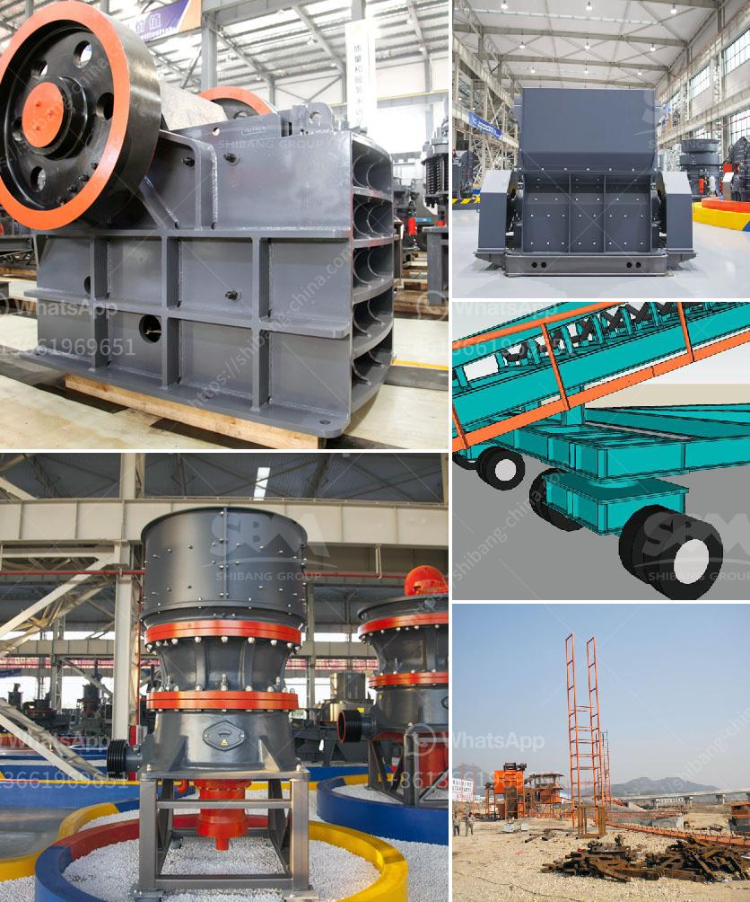

<h3>cold roll mills in turkey</h3>
Cold rolling mills play a crucial role in the manufacturing industry, particularly in the production of high-quality steel products. Turkey, known for its booming steel industry, has also made significant advancements in the cold rolling mill sector. With state-of-the-art technology and a focus on innovation, Turkish cold roll mills are now considered some of the best in the world.

Cold rolling mills are used to reduce the thickness and improve the surface quality of steel coils. The process involves passing the steel through a set of rollers at room temperature, which compresses and elongates the material. This results in increased strength, enhanced dimensional accuracy, and improved surface finish.

Turkey's steel industry has grown rapidly over the years, and the demand for cold-rolled products has been on the rise. To meet this growing demand, Turkish companies have heavily invested in modernizing their cold rolling mill facilities. This has enabled them to produce a wide range of high-quality products that cater to both domestic and international markets.

One of the key drivers behind the success of Turkish cold roll mills is the adoption of advanced technologies. Turkish companies have embraced digitalization, automation, and artificial intelligence to improve production efficiency and product quality. With the help of advanced systems and equipment, they can ensure precise control over the entire production process, resulting in consistent and reliable output.

Another factor contributing to the excellence of Turkish cold roll mills is the skill and expertise of the workforce. The steel industry in Turkey has a long history, and over the years, the industry has developed a highly skilled labor force. The technicians and engineers working in Turkish cold roll mills have a deep understanding of the process and possess the knowledge to handle the latest machinery and equipment efficiently.

Moreover, Turkish cold roll mills are known for their commitment to innovation. Continuous research and development activities are carried out to improve existing processes and introduce new products. These efforts have led to the development of specialized products for various industries, such as automotive, construction, and home appliances.

Turkey's strategic geographical location also contributes to the success of its cold roll mills. Situated at the crossroads of Europe, Asia, and the Middle East, Turkey provides easy access to international markets. This has made Turkish companies competitive in terms of pricing and delivery times, further establishing them as leading players in the global steel market.

In conclusion, cold rolling mills in Turkey have emerged as key players in the steel industry, thanks to their technological advancements, skilled workforce, and commitment to innovation. Their ability to produce high-quality products that meet global standards has positioned Turkey as a prominent player in the global steel market. As the demand for cold-rolled products continues to grow, Turkish cold roll mills are expected to contribute significantly to the country's economic growth and further strengthen its position as a leader in the steel industry.
<h3>Contact us</h3><ul><li><strong>Whatsapp:&nbsp;<a href="https://wa.me/8613661969651">+8613661969651</a></strong></li><li><a href="https://swt.shibang-china.com/?git&amp;zhl&amp;cold roll mills in turkey"><strong>Online Service(chat now)</strong></a></li></ul><h3>Related</h3><ul><li><a href='sell old stone crusher.md'>sell old stone crusher</a></li><li><a href='jaw crusher calculating.md'>jaw crusher calculating</a></li><li><a href='crusher for aggregate.md'>crusher for aggregate</a></li><li><a href='clinker production process.md'>clinker production process</a></li><li><a href='vibration screen machine in pakistan.md'>vibration screen machine in pakistan</a></li></ul>