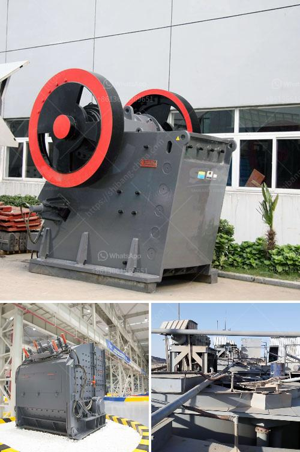

<h3>complete crusher for sale</h3>
A complete crusher refers to a set of machinery used to crush various materials into smaller pieces. These machines are commonly used in industries such as mining, construction, and recycling, where large rocks, ores, and other materials need to be broken down for further processing. This article will discuss the benefits of purchasing a complete crusher for sale, highlighting its functionality, efficiency, and availability in the market.

A complete crusher consists of several components, including a primary crusher, secondary crusher, and screening equipment. The primary crusher breaks down large rocks or ores into smaller pieces, while the secondary crusher further refines the material. The screening equipment ensures that the crushed material is of the desired size and quality. Additionally, conveyors and other auxiliary equipment may be included, enhancing the overall functionality of the crusher system.

Investing in a complete crusher for sale can significantly increase productivity and efficiency in various industries. The primary benefit is the ability to process a large volume of material within a shorter timeframe. This results in increased production output, reduced labor costs, and improved profitability. Moreover, a complete crusher system is designed to handle different types of materials, adapting to specific requirements and optimizing overall performance.

Complete crushers are available for sale worldwide, given the widespread demand for these machines in numerous industries. Many reputable manufacturers and suppliers offer a variety of crushing systems, providing customers with options that suit their specific needs and budgets. Both new and used complete crushers are available, allowing businesses to choose according to their financial capabilities. Additionally, manufacturers often provide extensive after-sales support, including installation, maintenance, and spare parts, ensuring smooth operations.

1. Cost-saving: Investing in a complete crusher eliminates the need to purchase individual machines separately, resulting in cost savings and reducing overall equipment expenses.

2. Versatility: A complete crusher can handle various materials, making it suitable for multiple applications in different industries.

3. Enhanced productivity: With higher throughput and operational efficiency, a complete crusher can significantly boost productivity and output.

4. Reduced downtime: Manufacturers often provide comprehensive support, minimizing potential disruptions and reducing downtime caused by maintenance or equipment failure.

5. Environmentally friendly: Many complete crushers are designed with sustainability in mind, incorporating features such as energy efficiency and reduced emissions.

A complete crusher for sale is a valuable investment for businesses in need of efficient and reliable crushing equipment. From mining and construction to recycling, a complete crusher system allows for the processing of various materials, resulting in increased productivity and profitability. With a wide range of options available in the market, businesses can find a complete crusher that meets their specific requirements and budget. By choosing to invest in a complete crusher, organizations can streamline their operations and contribute to sustainable practices within their industry.
<h3>Contact us</h3><ul><li><strong>Whatsapp:&nbsp;<a href="https://wa.me/8613661969651">+8613661969651</a></strong></li><li><a href="https://swt.shibang-china.com/?git&amp;zhl&amp;complete crusher for sale"><strong>Online Service(chat now)</strong></a></li></ul><h3>Related</h3><ul><li><a href='rock crushers for sale south africa.md'>rock crushers for sale south africa</a></li><li><a href='jaw crusher refurbished.md'>jaw crusher refurbished</a></li><li><a href='difference between ball mill and roller mill.md'>difference between ball mill and roller mill</a></li><li><a href='cost of bentonite manufacturing processing plant.md'>cost of bentonite manufacturing processing plant</a></li><li><a href='kaolin powder machine.md'>kaolin powder machine</a></li></ul>