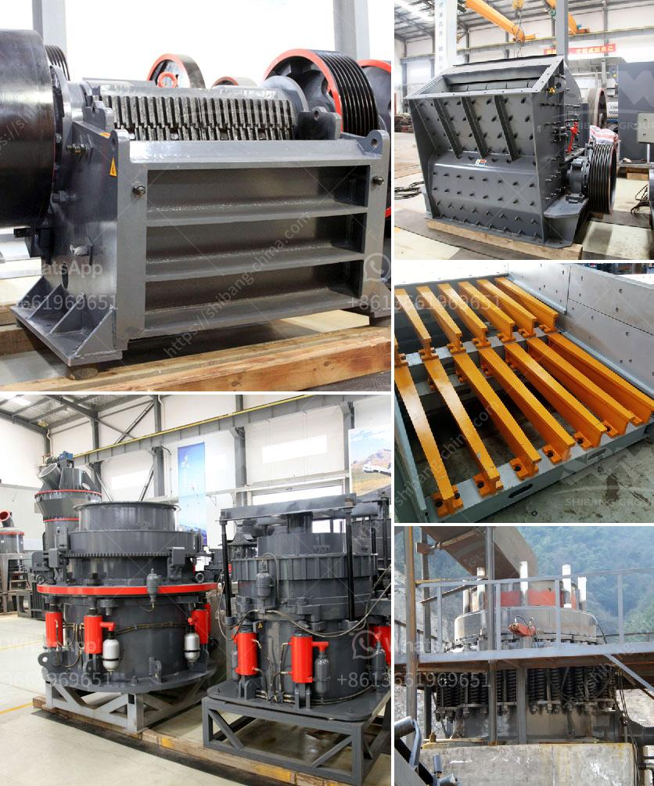

<h3>complete crushing plant 150 200t</h3>
In recent years, the mining industry has been flourishing due to the increasing demand for raw materials. To meet this growing demand, the need for efficient and cost-effective crushing equipment has become crucial. This is where the complete crushing plant 150-200t enters the picture. A game changer in the crushing industry, this plant offers a convenient and versatile solution to effectively crush materials.

The complete crushing plant 150-200t is designed for medium-scale stone quarrying plant, aggregate plant, mineral beneficiation plant, and so on. This crushing plant can crush the most common materials like granite, basalt, barite, limestone, quartzite, marble, sandstone, cobble stone, iron ore, copper, gold, bauxite, and so on. It is widely used in mining, metallurgy, construction, highway, railway, water conservancy, and chemical industries.

One of the key features of the complete crushing plant 150-200t is its flexibility. It can be configured as a complete stone crushing line, or it can be combined with other equipment according to specific requirements. This plant includes various crushing machines, such as jaw crusher, impact crusher, cone crusher, vibrating screen, belt conveyor, and centrally electric controlling system, etc. All these machines work together to efficiently crush the materials and produce high-quality aggregates.

Another remarkable aspect of this crushing plant is its high production capacity. With a capacity of 150-200 tons per hour, it can easily meet the demands of a medium-scale operation. This makes it an ideal choice for contractors and quarry owners who need to process large quantities of materials within a short period of time.

Furthermore, the complete crushing plant 150-200t is equipped with advanced technology to enhance its performance. The use of hydraulic systems enables easy adjustment of the crushing gap and the discharge setting, providing greater control over the final product size. Additionally, the plant is designed with a dust suppression system to minimize dust pollution, creating a safer and more eco-friendly working environment.

One notable advantage of choosing the complete crushing plant 150-200t is its cost-effectiveness. Investing in this plant eliminates the need for multiple machines and reduces the overall cost of production. Its efficient crushing process ensures a higher yield of quality aggregates, which in turn increases revenue for the operators.

In conclusion, the complete crushing plant 150-200t is a game changer in the crushing industry. Its flexibility, high production capacity, advanced technology, and cost-effectiveness make it a top choice for any quarrying or mining operation. Whether it is used for primary crushing or secondary crushing, this plant ensures the reliable and efficient processing of various materials. Embracing this crushing plant will undoubtedly lead to improved productivity and profitability for the operators.
<h3>Contact us</h3><ul><li><strong>Whatsapp:&nbsp;<a href="https://wa.me/8613661969651">+8613661969651</a></strong></li><li><a href="https://swt.shibang-china.com/?git&amp;zhl&amp;complete crushing plant 150 200t"><strong>Online Service(chat now)</strong></a></li></ul><h3>Related</h3><ul><li><a href='mobile gold processing plant 1 2 tph.md'>mobile gold processing plant 1 2 tph</a></li><li><a href='materials for conveyor belts in nigeria.md'>materials for conveyor belts in nigeria</a></li><li><a href='500mm vertical mill stones price.md'>500mm vertical mill stones price</a></li><li><a href='calcium carbonate rock crusher.md'>calcium carbonate rock crusher</a></li><li><a href='how much does a crusher.md'>how much does a crusher</a></li></ul>