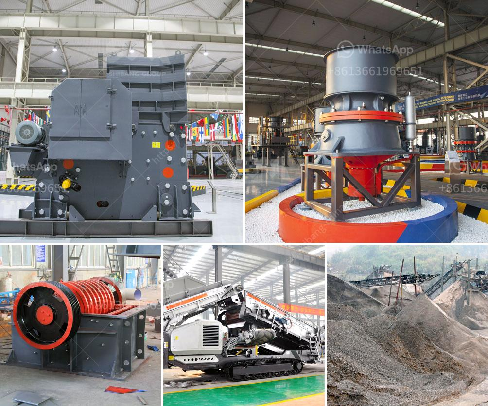

<h3>complete gold mining equipment for small scale mines</h3>
Gold mining is a profitable venture that has been enjoyed for centuries, giving individuals the opportunity to strike it rich. However, for small-scale mines, it is crucial to have the right equipment to ensure maximum productivity and efficiency. Here, we will explore some essential gold mining equipment for small-scale mines.

First and foremost, a reliable gold detector is a must-have tool. It is designed to detect even the smallest gold particles buried deep within the ground. With cutting-edge technology, these detectors can differentiate between gold and other minerals, saving miners valuable time and effort.

Another essential piece of equipment is the gold pan. This simple yet effective tool allows miners to quickly extract gold from sand and gravel. It is lightweight, portable, and can be used in various mining environments, making it a staple for small-scale mines.

Furthermore, a sluice box is a versatile piece of equipment that aids in the process of separating gold from other materials. It uses running water to wash away unwanted debris and retain gold particles. Sluice boxes come in various sizes, allowing miners to choose the one that best suits their needs.

When it comes to efficient gold mining, a high-powered motorized trommel is highly recommended. This machine uses water and agitation to separate gold from gravel and rocks. It is capable of processing large amounts of material quickly, making it essential for small-scale mines.

Lastly, small-scale miners should invest in a reliable and durable rock crusher. These machines are designed to break down rock into smaller pieces, making it easier to extract gold. They come in different sizes and configurations, allowing miners to choose the one that best fits their operation.

In conclusion, having the right equipment is crucial for small-scale gold mining operations. With a reliable gold detector, gold pan, sluice box, motorized trommel, and rock crusher, small-scale miners can optimize their mining efforts and increase their chances of striking gold. These tools not only enhance productivity, but also ensure the safety and efficiency of the mining process.
<h3>Contact us</h3><ul><li><strong>Whatsapp:&nbsp;<a href="https://wa.me/8613661969651">+8613661969651</a></strong></li><li><a href="https://swt.shibang-china.com/?git&amp;zhl&amp;complete gold mining equipment for small scale mines"><strong>Online Service(chat now)</strong></a></li></ul><h3>Related</h3><ul><li><a href='diagram of hammer mill machine.md'>diagram of hammer mill machine</a></li><li><a href='used gold mills for sale.md'>used gold mills for sale</a></li><li><a href='machinery used in making dolomite powder.md'>machinery used in making dolomite powder</a></li><li><a href='ball mill in zimbabwe.md'>ball mill in zimbabwe</a></li><li><a href='marble ball mill.md'>marble ball mill</a></li></ul>