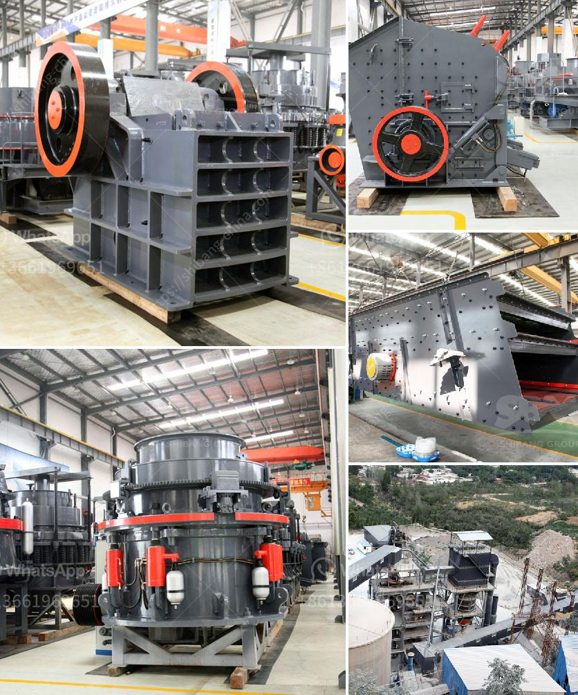

<h3>concrete breakers for sale in south africa</h3>
Concrete breakers, also known as jackhammers or demolition hammers, are important tools used in construction sites to break up concrete and other hard materials. These heavy-duty machines are designed to deliver powerful blows to effectively and efficiently demolish structures or remove unwanted concrete. In South Africa, there is a wide range of concrete breakers available for sale, making it easier for construction professionals to find the perfect tool for their needs.

One of the key factors to consider when looking for concrete breakers for sale in South Africa is the type of breaker that suits the specific project requirements. There are different types of breakers available, including hydraulic breakers, pneumatic breakers, and electric breakers. Each type has its own advantages and disadvantages, and the choice depends on the scale of the project, available power sources, and the working conditions.

Hydraulic breakers are commonly used in large-scale demolition projects due to their exceptional power and efficiency. They are typically attached to excavators or other heavy machinery and provide high impact force to break through even the toughest concrete. Hydraulic breakers are known for their reliability and low maintenance requirements, making them a popular choice among construction professionals.

Pneumatic breakers, on the other hand, are powered by compressed air and are ideal for smaller projects or areas with limited power sources. These breakers are lightweight, portable, and easy to handle, making them suitable for situations where maneuverability is crucial. Pneumatic breakers are often used in road construction, as well as small-scale demolition work.

Electric breakers, as the name suggests, are powered by electricity and are commonly used for light to medium-duty applications. They are quieter compared to hydraulic and pneumatic breakers, making them suitable for indoor projects or areas with noise restrictions. Electric breakers are generally lightweight and easy to operate, making them ideal for DIY enthusiasts or smaller construction projects.

When looking for concrete breakers for sale in South Africa, it is important to consider the brand and quality of the tool. A reputable brand with a proven track record of manufacturing reliable and durable equipment is essential to ensure safe and efficient operation. It is also advisable to check for warranties and after-sales service support offered by the seller or manufacturer. This guarantee will provide peace of mind in case of any unforeseen issues or repairs needed in the future.

Furthermore, understanding the specific requirements of the project and seeking professional advice can help in choosing the right concrete breaker. Factors such as the type and thickness of the concrete, working conditions, and available power sources should be taken into account to ensure optimal performance and productivity.

In conclusion, South Africa offers a wide range of concrete breakers for sale, catering to the diverse needs of construction professionals. Considering factors such as the type of breaker, power source, brand reputation, and project requirements will help in finding the perfect tool for the job. Choosing a reliable and high-quality concrete breaker will not only ensure successful demolition and concrete removal but also enhance productivity and safety on the construction site.
<h3>Contact us</h3><ul><li><strong>Whatsapp:&nbsp;<a href="https://wa.me/8613661969651">+8613661969651</a></strong></li><li><a href="https://swt.shibang-china.com/?git&amp;zhl&amp;concrete breakers for sale in south africa"><strong>Online Service(chat now)</strong></a></li></ul><h3>Related</h3><ul><li><a href='nigeria mobile crusher.md'>nigeria mobile crusher</a></li><li><a href='china processing plants for sale.md'>china processing plants for sale</a></li><li><a href='granite mining in zimbabwe.md'>granite mining in zimbabwe</a></li><li><a href='fly ash introduction in cement ball mill.md'>fly ash introduction in cement ball mill</a></li><li><a href='maize ball mills in south africa.md'>maize ball mills in south africa</a></li></ul>