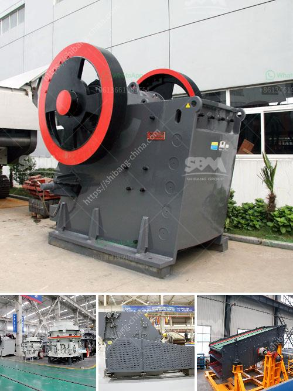

<h3>concrete crushing equipment</h3>
Concrete crushing is a process that involves heavy duty machinery breaking down large blocks of concrete into smaller, more manageable pieces. When concrete is no longer needed or has reached the end of its life cycle, it is recycled. There are different types of crushing equipment that are used to carry out this task.

Jaw Crushers: Jaw crushers are heavy duty machines designed to efficiently crush hard materials. They use compressive force to break down the concrete by applying pressure to a fixed plate and a moving plate that moves back and forth. This action compresses the rock, causing it to break along its natural fissures. Jaw crushers are ideal for primary crushing applications and are commonly used in the construction and demolition industry.

Impact Crushers: Impact crushers use impact forces to crush material. Instead of pressure, the material is fragmented by the striking impact of the hammers that are fixed to a spinning rotor. This rotor is propelled by an electric motor or diesel engine, resulting in a high-speed collision between the hammers and the concrete. Impact crushers are versatile and can be used in various applications, including the recycling of concrete.

Cone Crushers: Cone crushers are also compression-type machines that are typically used in the secondary or tertiary stage of crushing. They consist of a rotating mantle inside a concave bowl. As the material enters the cone crusher, it is squeezed between the mantle and the concave, resulting in a fine or even product. Cone crushers are commonly used in aggregate production, mining operations, and recycling applications.

Mobile Crushers: Mobile crushers allow for fast and easy transportation of equipment to and from the construction site. They are designed to be compact and can easily navigate through narrow spaces and access smaller areas. Mobile crushers are equipped with tracks or wheels, enabling them to be moved around the site as needed. They offer flexibility and versatility in crushing concrete in different locations.

Concrete crushing equipment is essential for the efficient and cost-effective recycling of concrete debris. The crushing process provides a way to remove steel reinforcement from the concrete and separate it into different sized materials. This allows the recycled concrete to be reused in various applications, such as road base, construction fill, landfill cover, or as aggregate in new concrete production. 

Moreover, using concrete crushing equipment is also environmentally friendly. By recycling concrete, it reduces the need for new construction materials, saving energy, resources, and reducing the emission of greenhouse gases associated with the production of new concrete. It also helps to reduce landfill waste, as concrete debris is diverted from landfills and can be used for beneficial purposes.

In conclusion, concrete crushing equipment plays a vital role in the recycling of concrete. From jaw crushers to mobile crushers, there are various types of equipment available to efficiently crush concrete into smaller, more manageable pieces. This not only promotes sustainable construction practices but also helps to conserve resources and protect the environment.
<h3>Contact us</h3><ul><li><strong>Whatsapp:&nbsp;<a href="https://wa.me/8613661969651">+8613661969651</a></strong></li><li><a href="https://swt.shibang-china.com/?git&amp;zhl&amp;concrete crushing equipment"><strong>Online Service(chat now)</strong></a></li></ul><h3>Related</h3><ul><li><a href='used hammer mill.md'>used hammer mill</a></li><li><a href='vibrating screen made in the philippines.md'>vibrating screen made in the philippines</a></li><li><a href='quartz manufacturing plant.md'>quartz manufacturing plant</a></li><li><a href='trackmounted equipment.md'>track-mounted equipment</a></li><li><a href='mobile jaw crusher plant.md'>mobile jaw crusher plant</a></li></ul>