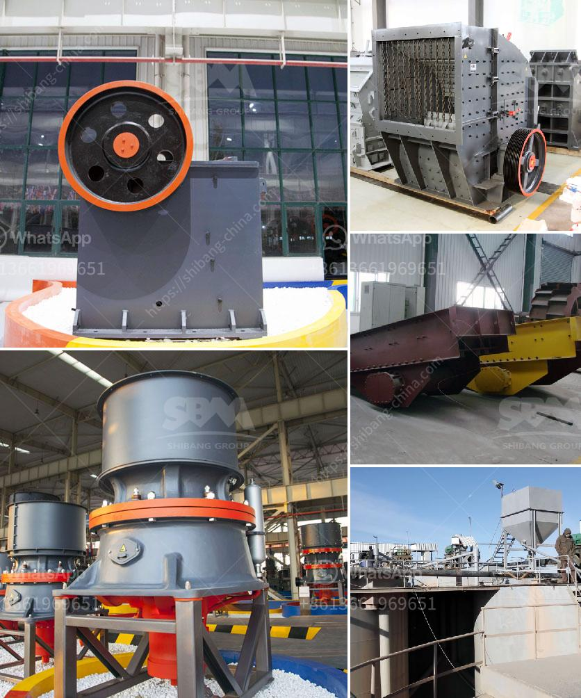

<h3>concrete grinder diamatic</h3>
If you have ever dealt with concrete floors, you know how challenging it can be to achieve that mirror-like finish. Uneven surfaces, cracks, and imperfections often hamper the process. However, with the revolutionary Concrete Grinder Diamatic, these problems are a thing of the past.

The Diamatic concrete grinder is a highly versatile tool that is designed to smooth and polish concrete surfaces effortlessly. It employs diamond grinding discs or pads to remove imperfections and create a smooth and glossy finish. Regardless of whether you are dealing with a small residential space or a large commercial area, this concrete grinder is your go-to tool for all your concrete polishing needs.

One of the standout features of the Diamatic grinder is its exceptional efficiency. Its powerful motor and sturdy construction allow for quick and effective grinding. With its adjustable drive speed, you can easily adapt its performance to various applications.

Furthermore, the Diamatic grinder is equipped with advanced dust collection systems that effectively capture and control the dust produced during the grinding process. This not only helps maintain a clean working environment but also promotes worker safety by reducing dust exposure.

Another notable feature of this grinder is its user-friendly design. It is equipped with an ergonomic handle and adjustable height settings, ensuring comfortable operation for extended periods. Additionally, the Diamatic grinder is known for its durability, making it a long-lasting and reliable tool for concrete polishing.

The Diamatic concrete grinder is suitable for a wide range of applications. From leveling uneven concrete surfaces to removing coatings and adhesives, it delivers exceptional results, regardless of the task at hand. Its versatility makes it a favorite among contractors, decorators, and DIY enthusiasts alike.

In conclusion, the Diamatic concrete grinder is a game-changer in the field of concrete polishing. Its efficiency, ease of use, and durability make it the ultimate tool for achieving that flawless and professional finish. Whether you are a contractor or a DIY enthusiast, investing in the Diamatic grinder is a decision that will elevate your concrete polishing experience to a whole new level.
<h3>Contact us</h3><ul><li><strong>Whatsapp:&nbsp;<a href="https://wa.me/8613661969651">+8613661969651</a></strong></li><li><a href="https://swt.shibang-china.com/?git&amp;zhl&amp;concrete grinder diamatic"><strong>Online Service(chat now)</strong></a></li></ul><h3>Related</h3><ul><li><a href='dolomite powder mill.md'>dolomite powder mill</a></li><li><a href='vertical mill manufacturers.md'>vertical mill manufacturers</a></li><li><a href='milling equipment ball mill.md'>milling equipment ball mill</a></li><li><a href='quarry impact crusher equipment.md'>quarry impact crusher equipment</a></li><li><a href='stone crusher for gold mining in south africa.md'>stone crusher for gold mining in south africa</a></li></ul>