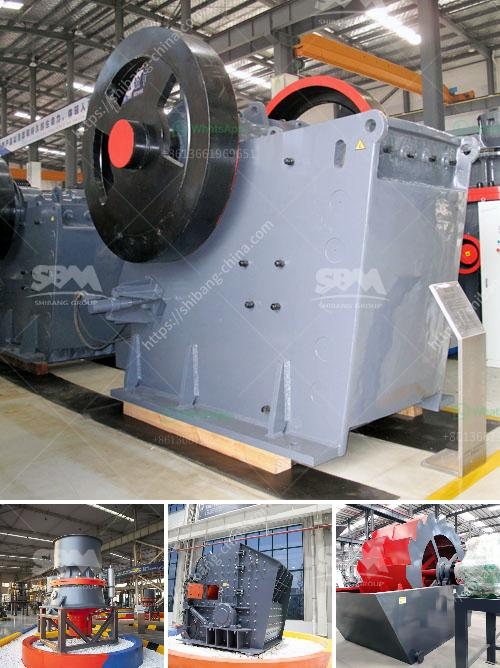

<h3>cone complete crusher plant</h3>
In the ever-evolving construction industry, efficiency and productivity are key to staying ahead of the competition. One innovative solution that has revolutionized the crushing process is the cone complete crusher plant. This game-changing equipment is designed to enhance efficiency, reduce downtime, and ultimately drive profitability for construction businesses.

The cone complete crusher plant consists of several components that work together to crush and screen rocks, stones, and minerals into various sizes for different construction applications. The key component of the plant is the cone crusher, a powerful machine that reduces the size of the raw material by squeezing it between an eccentrically gyrating mantle and a concave hopper.

One of the remarkable features of the cone complete crusher plant is its versatility. It can handle a wide range of materials, from limestone to basalt, and from river stones to hard rock ores. This flexibility allows construction companies to handle diverse projects without the need for multiple equipment setups, thereby reducing costs and increasing efficiency.

The cone complete crusher plant also incorporates a vibrating screen, which ensures that the crushed material is properly sorted and segregated into different sizes. This is crucial for ensuring that the final product meets the desired specifications and quality standards set by the construction industry. By eliminating the need for additional screening equipment, the cone complete crusher plant streamlines the crushing process, saving time and manpower.

Another significant advantage of the cone complete crusher plant is its mobility. With the advent of track-mounted crushers, construction companies can easily transport the equipment to different job sites. This eliminates the need for costly dismantling, transportation, and reassembly, resulting in significant time and cost savings. Moreover, the plant can be set up and operational within a short period, allowing construction companies to start crushing and screening operations quickly.

The cone complete crusher plant is also equipped with advanced automation features that optimize its performance and enhance productivity. This includes features like automatic feed control, which adjusts the feed rate based on the crusher load, ensuring efficient crushing and preventing overloading. The plant also incorporates a hydraulic system that allows for easy adjustment of the crusher settings, ensuring high-quality end products.

Furthermore, the cone complete crusher plant comes with built-in safety features to protect operators and maintenance personnel. These include safety guards, emergency stops, and interlocks that prevent unauthorized access. By prioritizing safety, the plant minimizes the risk of accidents and ensures a safe working environment.

In conclusion, the cone complete crusher plant is a game-changer in the construction industry. Its versatility, mobility, and advanced automation features significantly enhance efficiency, reduce downtime, and increase profitability for construction companies. With the ability to handle a wide range of materials, the plant eliminates the need for multiple equipment setups. Additionally, its mobility enables easy transportation, while automation optimizes its performance. The cone complete crusher plant is the perfect solution for any construction business looking to upgrade its crushing capabilities and stay ahead in a competitive market.
<h3>Contact us</h3><ul><li><strong>Whatsapp:&nbsp;<a href="https://wa.me/8613661969651">+8613661969651</a></strong></li><li><a href="https://swt.shibang-china.com/?git&amp;zhl&amp;cone complete crusher plant"><strong>Online Service(chat now)</strong></a></li></ul><h3>Related</h3><ul><li><a href='mobile jaw crusher price.md'>mobile jaw crusher price</a></li><li><a href='sample busines project proposal for stone crusher.md'>sample busines project proposal for stone crusher</a></li><li><a href='crusher machines for granite in nigeria.md'>crusher machines for granite in nigeria</a></li><li><a href='crusher processing plant malaysia.md'>crusher processing plant malaysia</a></li><li><a href='marble grinding machines factory in turkey.md'>marble grinding machines factory in turkey</a></li></ul>