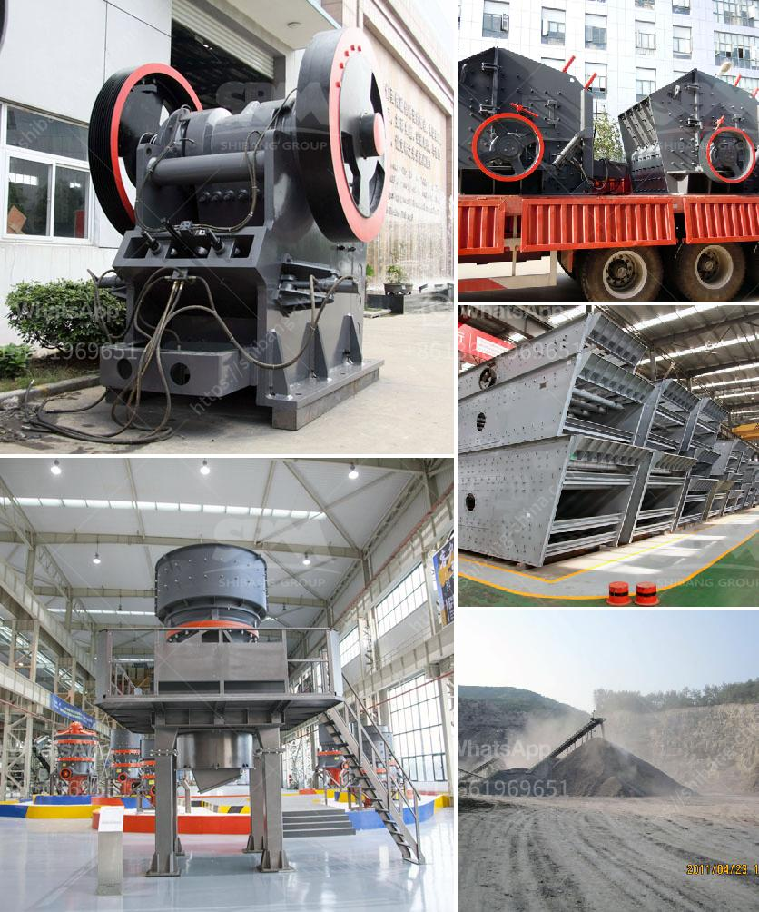

<h3>cone crusher design guideline pdf</h3>
The cone crusher is a versatile crushing machine that utilizes advanced technology to provide high-quality aggregates for the construction industry. Therefore, it is imperative to ensure the efficient operation and optimal performance of this equipment. To achieve this, a proper design guideline for cone crushers should be adhered to. This article will discuss the essential aspects that should be considered when designing a cone crusher, with a focus on a comprehensive and practical approach.

One of the first considerations in cone crusher design is the crushing chamber. This chamber plays a crucial role in determining the product size, as well as the particle shape and gradation. The ideal crushing chamber should provide a uniform feed distribution throughout its entire length, ensuring consistent crushing action. It is recommended to design a chamber that promotes inter-particle crushing, rather than single-particle crushing. This can be achieved by incorporating a steep crushing angle and a long parallel crushing zone.

Another important aspect of cone crusher design is the mantle and concave profiles. These components directly affect the crusher's performance, especially in terms of capacity, power draw, and product size distribution. Utilizing computer-aided design (CAD) software can greatly assist in optimizing the mantle and concave profiles, resulting in improved performance. Furthermore, it is advisable to regularly monitor and measure the wear of these components to ensure timely replacements.

The eccentric throw is another critical parameter in cone crusher design. It refers to the distance that the mantle moves during gyrations, affecting the crusher's performance and product size distribution. A larger eccentric throw generally results in coarser product sizes, while a smaller throw leads to finer product sizes. The eccentric throw can be adjusted to achieve the desired product size by changing the eccentric bushing.

Additionally, the operational parameters of the cone crusher must be considered during the design phase. These parameters include the feed size, closed-side setting (CSS), and the feeding arrangement. Correctly selecting these parameters will help maximize the crusher's efficiency and avoid potential issues such as excessive liner wear, power overloads, and poor particle shape. It is also recommended to consider automation and remote operation features to enhance the overall safety and ease of operation.

In conclusion, designing a cone crusher requires a comprehensive understanding of various factors that influence its performance. This article has presented a condensed guideline for cone crusher design, focusing on the crucial aspects that should be considered. Designing an efficient and reliable cone crusher involves optimizing the crushing chamber, mantle and concave profiles, eccentric throw, and operational parameters. By following these guidelines, manufacturers and engineers can develop cone crushers that meet the industry's demands for high-quality aggregates and sustainable production.
<h3>Contact us</h3><ul><li><strong>Whatsapp:&nbsp;<a href="https://wa.me/8613661969651">+8613661969651</a></strong></li><li><a href="https://swt.shibang-china.com/?git&amp;zhl&amp;cone crusher design guideline pdf"><strong>Online Service(chat now)</strong></a></li></ul><h3>Related</h3><ul><li><a href='sand washing machinery.md'>sand washing machinery</a></li><li><a href='quarry making machine from south africa.md'>quarry making machine from south africa</a></li><li><a href='mineral grinding raymond.md'>mineral grinding raymond</a></li><li><a href='how to shim a jaw crusher.md'>how to shim a jaw crusher</a></li><li><a href='cost of setting up cement plant per mtpa.md'>cost of setting up cement plant per mtpa</a></li></ul>