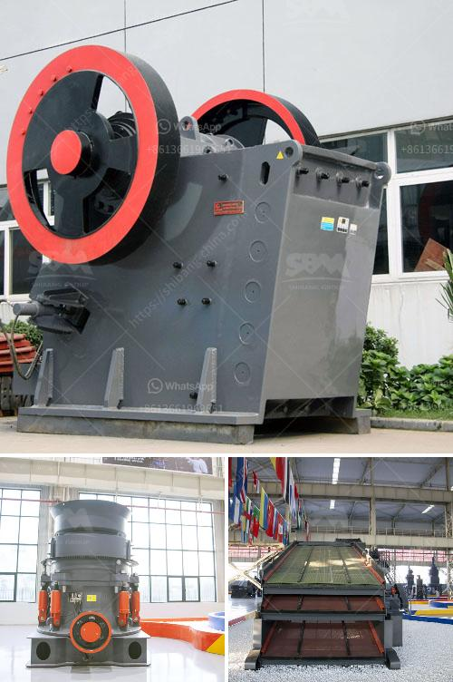

<h3>cone crusher factory south africa</h3>
Mining companies in South Africa are constantly looking for ways to improve their operations and efficiency. With increasing pressure to reduce costs, many are turning to innovative solutions to optimize their processes. One such solution is the cone crusher, a piece of machinery widely used in mining to break down large rocks into smaller, more manageable sizes.

In South Africa, cone crushers are used predominantly in the mining industry. It is not uncommon for large mining operations to have several crushers running simultaneously, as this allows for continuous production of crushed rock materials. However, not all crushers are created equal, and finding a reliable and efficient crusher is crucial for successful mining operations.

Enter the cone crusher factory in South Africa. These factories are equipped with state-of-the-art technology and machinery, allowing for the production of high-quality and durable cone crushers. From design to manufacturing, these factories ensure that every aspect of the crusher meets the highest engineering standards.

Cone crushers produced in South African factories come in a variety of models, each designed to cater to specific mining requirements. Whether it's handling large rock materials or processing ores, there is a cone crusher model suitable for the task.

Furthermore, cone crusher factories in South Africa prioritize efficiency and durability. These crushers are often subjected to harsh mining conditions, including extreme temperatures and heavy usage. Therefore, the materials and components used in the manufacturing process are chosen carefully to ensure reliability and longevity.

Investing in a cone crusher from a reputable factory in South Africa can have a significant impact on mining operations. Not only does it improve productivity and efficiency, but it also reduces overall maintenance costs. With enhanced production and cost savings, mining companies can allocate resources to other essential aspects of their operations.

In conclusion, cone crusher factories in South Africa are delivering efficiency to the mining industry. With their high-quality products and focus on durability, these factories help mining companies overcome operational challenges and enhance productivity. By investing in a cone crusher from a reliable factory, mining operations can achieve optimal results and contribute to the growth of the industry.
<h3>Contact us</h3><ul><li><strong>Whatsapp:&nbsp;<a href="https://wa.me/8613661969651">+8613661969651</a></strong></li><li><a href="https://swt.shibang-china.com/?git&amp;zhl&amp;cone crusher factory south africa"><strong>Online Service(chat now)</strong></a></li></ul><h3>Related</h3><ul><li><a href='rock crusher in dubai.md'>rock crusher in dubai</a></li><li><a href='cost estimate ball mill.md'>cost estimate ball mill</a></li><li><a href='gold ore hammer mills prices mining supplies in zimbabwe.md'>gold ore hammer mills prices mining supplies in zimbabwe</a></li><li><a href='gypsum mines in orissa india.md'>gypsum mines in orissa india</a></li><li><a href='method statement for a barite mill.md'>method statement for a barite mill</a></li></ul>