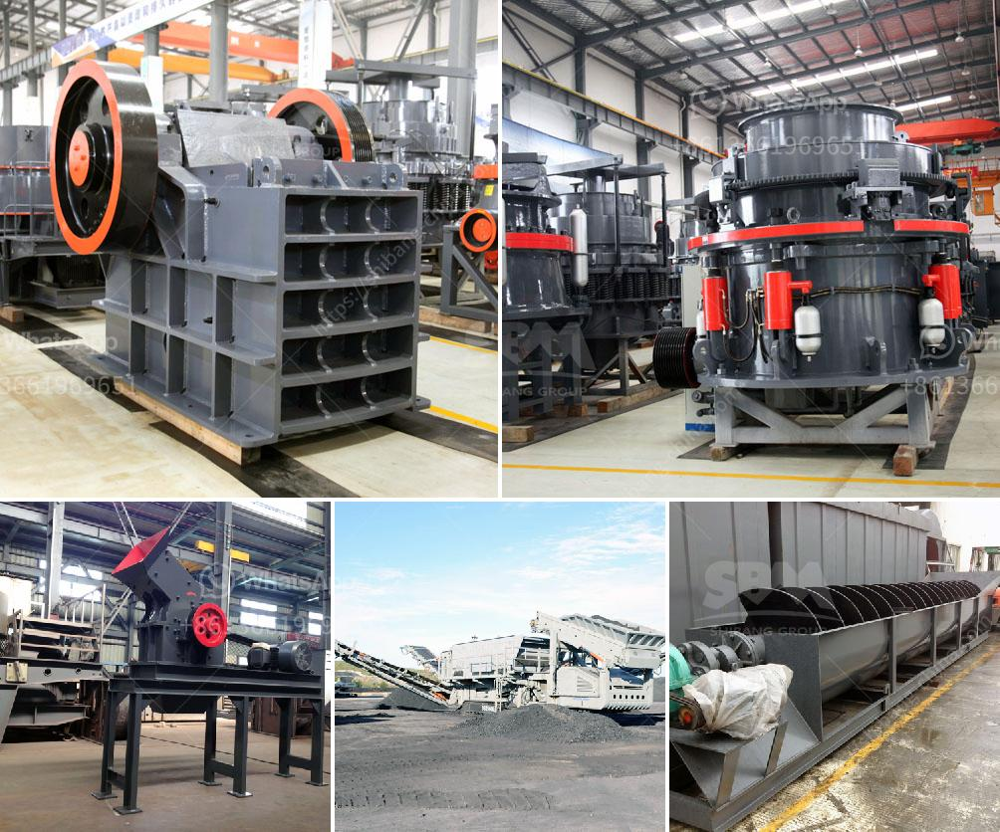

<h3>cone crusher for salae used</h3>
Cone crushers are a popular choice for secondary and tertiary crushing stages in a variety of applications. As the name suggests, cone crushers resemble cones and utilize a gyrating, cone-shaped core that oscillates against the interior of the machine housing. To break down materials into smaller pieces, cone crushers apply compressive forces while rotating, thus reducing the size and shape of rocks, ores, and other materials.

There are several key advantages to using cone crushers in various industries. One major benefit is their ability to process a wide range of materials, making them suitable for diverse applications. Cone crushers can efficiently crush hard and abrasive materials such as granite, basalt, and limestone. They are also ideal for softer materials like river gravel or recycled concrete. This versatility allows cone crushers to be utilized in mining, road construction, metallurgical industries, and more.

When considering purchasing a cone crusher, the most important factor is the crusher's capacity. This refers to the maximum amount of material the machine can process in a given time frame. Typically, cone crushers are classified by their capacity in terms of the tons per hour they can produce. Different models have different capacities, and it is crucial to select a cone crusher that suits your production needs.

Another factor to consider when buying a cone crusher is the power consumption. Cone crushers require electricity to operate, and the power consumption varies depending on the model and size of the machine. Lower power consumption is desirable as it reduces operational costs and promotes energy efficiency. Additionally, understanding the power supply requirements is vital, ensuring compatibility with the available infrastructure.

The condition of a used cone crusher is also a critical aspect to evaluate before making a purchase. Inspecting the machine thoroughly and understanding its maintenance history can help determine its reliability and longevity. It is important to look for signs of wear and tear, such as damaged components or excessive vibrations, as these issues can be indications of potential problems down the line.

One practical approach to acquiring a used cone crusher is through reputable dealers or sellers. These professionals often have a wide range of cone crushers available, offering various models, capacities, and conditions. They can provide valuable insights and guidance throughout the purchasing process, helping you select the most suitable option for your specific needs.

In conclusion, cone crushers are versatile and efficient machines used in a variety of industries. Their ability to process various materials and their wide range of available capacities make them highly sought after. When considering buying a used cone crusher, it is essential to evaluate its capacity, power consumption, and general condition. Consulting reputable dealers or sellers can provide guidance and help ensure a smooth purchasing experience. With proper consideration and research, investing in a used cone crusher can be a cost-effective solution for your crushing needs.
<h3>Contact us</h3><ul><li><strong>Whatsapp:&nbsp;<a href="https://wa.me/8613661969651">+8613661969651</a></strong></li><li><a href="https://swt.shibang-china.com/?git&amp;zhl&amp;cone crusher for salae used"><strong>Online Service(chat now)</strong></a></li></ul><h3>Related</h3><ul><li><a href='stone crusher machine prices.md'>stone crusher machine prices</a></li><li><a href='stone crusher buatan indonesia.md'>stone crusher buatan indonesia</a></li><li><a href='ball mill grinding manufacturer in india.md'>ball mill grinding manufacturer in india</a></li><li><a href='dry process of cement.md'>dry process of cement</a></li><li><a href='mobile gold processing plant 1 2 tph.md'>mobile gold processing plant 1 2 tph</a></li></ul>