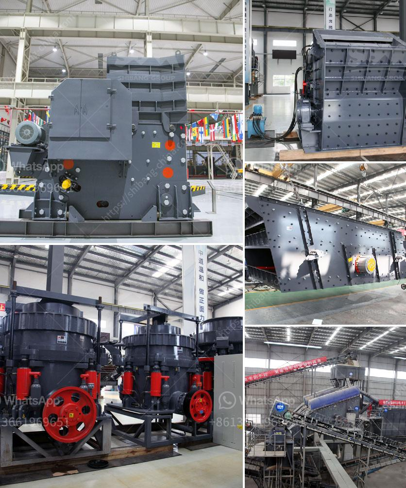

<h3>cone crusher for sale in india</h3>
India is rich in various mineral resources and it is an important mineral processing market. With the development of local economy, lots of mineral processing plants are built there. As a famous stone crushing machine manufacturer, SBM can provide clients the high quality machine and low stone crusher plant cost.

Stone crusher is widely used in mining, metallurgical, construction, chemistry, petrochemicals, transportation, energy, building materials industry, suitable for crushing high hard, mid hard and soft rocks and ores such as iron ore, limestone, slag, marble, quartz, granite, cement, clinker and so on. Whole Stone Crusher Plant Equipment:

The whole stone crusher plant plays vital role in the mining process. Jaw crusher, cone crusher, impact crusher, VSI crusher and hammer crusher is the main equipment in stone crusher plant. The vibrating feeder takes the raw materials into jaw crusher for the first crushing process. The big block materials will be crushed into small size. With cone crusher or impact crusher, the materials will be crushed into fine size. VSI crusher is used to crush the relative hard materials. In the whole production process, the vibrating feeder, vibrating screen and belt conveyor work together with the main crushing equipment to complete the mining process.

Stone crusher machine costs are the important factor for clients to choose the suitable processing crusher equipment. Providing customers high quality equipment and low stone ore crusher price is our goal. Depending on years' experience and high technology, SBM has manufactured a series of crushing machine to satisfy different customers' needs.

India is rich in various kinds of mineral ores, such as iron ore, gold ore, tin ore and many other kinds of stones. It is one of SBM’s most important markets. An Cone Crusher for sale is actually a kind of crusher machine that can reduce the size of raw stone particles and materials, which is suitable for all kinds of ores and large pieces of materials. It is widely used in mining smelting, building materials, highway, railway, water conservancy and chemical industries, etc.

According to the particle size of the raw materials, we can divide the crushing process into four processes: coarse crushing, medium crushing, fine crushing and sand making. For coarse crushing, a jaw crusher or gyratory crusher is used, and for medium crushing, a cone crusher or impact crusher is used. The sand making machine is commonly used in the final process of crushing and shaping materials.

India is rich in various mineral resources and it is an important mineral processing market. With the development of local economy, lots of mineral processing plants are built there. SBM has built our oversea office in India for many years and we have numerous customers there, the market is quite mature. Customers Background:

Our India is rich in various mineral resources, such as iron ore, gold ore, tin ore and many other kinds of stones. It is one of SBM Company most important markets, every year, there are amount of equipment installed in India. And our products are more and more popular by its high quality and good performance. The Features of Cone Crusher for sale: 1. Highly performance crusher: As we can see, in the working process of cone crusher, crushing cavity is opened and pieces of materials are squeezed, fractured and crushed in the crushing cavity. So the performance of the cone crusher is higher than the same size of spring cone crusher. 2. Less spare part consumption: Cone crusher has variety of consumable parts, which can reduce its cost. However, the material does not change during the cone crusher extraction process, so it does not require frequent replacement parts. Of course, if a larger production capacity is required, the replacement of vulnerable parts also increases. 3. Low cost and wide application for China cone crusher Cone crusher mainly used in the secondary, tertiary rock crushing stage with high efficiency and good performance, suitable for a variety of operations, such as mine, quarry, concrete, aggregate, recycling. Cone crushers are a compression type machine usually placed after the jaw crusher to further size reduction and particle shaping, feed materials are continuously squeezed and compressed between a fixed steel and a fixed steel.

Cone crusher is widely used in metallurgical, construction, road building, chemical and phosphatic industry. It is suitable for hard and mid-hard rocks and ores, such as iron ores, copper ores, limestone, quartz, granite, grit stone, etc. Cone crusher is under the high demands of the market and customers. So, when choosing cone crusher manufacturer, customers should not only pay attention to its price, but also the strength of the manufacturer, size and strength of the enterprise, good after-sales service. To how to choose a high quality cone crusher supplier, we may suggest that you can choose a reliable cone crusher manufacturer with full range models in market.
<h3>Contact us</h3><ul><li><strong>Whatsapp:&nbsp;<a href="https://wa.me/8613661969651">+8613661969651</a></strong></li><li><a href="https://swt.shibang-china.com/?git&amp;zhl&amp;cone crusher for sale in india"><strong>Online Service(chat now)</strong></a></li></ul><h3>Related</h3><ul><li><a href='automatic terrazzo pressing machine.md'>automatic terrazzo pressing machine</a></li><li><a href='limestone manufacturer supplier egypt.md'>limestone manufacturer supplier egypt</a></li><li><a href='crusher seller in ethiopia.md'>crusher seller in ethiopia</a></li><li><a href='small sand washing machine.md'>small sand washing machine</a></li><li><a href='clay aggregate machinery product.md'>clay aggregate machinery product</a></li></ul>