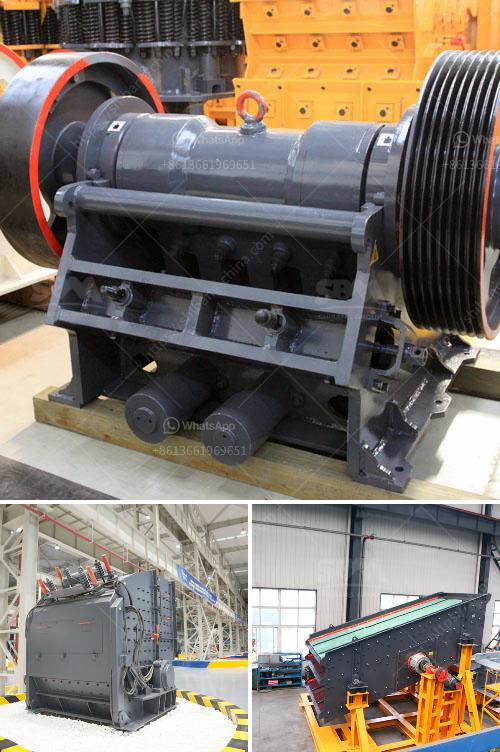

<h3>cone crusher germany</h3>
Cone crusher is an amazing equipment that is used in construction sites and mining operations for secondary, tertiary, and quaternary crushing to ensure an efficient and effective operation of extracting valuable minerals and stones. It is known to be an essential tool in the German construction industry due to its versatility, reliability, and high performance.

Germany has been a frontrunner when it comes to technological advancements and engineering prowess in the world. It is no surprise that German-made crushers, including cone crushers, are widely used not only in Germany but also in other countries around the globe.

One of the key players in the German cone crusher industry is Kleemann. This reputable brand has been producing reliable and durable cone crushers for over 100 years. Their crushers are suitable for a wide range of applications, including mining, quarrying, and recycling.

A cone crusher is built to crush rock and stone with the help of a concave and mantle. The cone crusher's motor rotates the mantle and concave, crushing the materials between them. As the mantle moves, it also performs eccentric movements, causing the rock to be crushed even more.

The key advantage of cone crushers is that they offer an efficient and precise crushing process, which results in a higher yield of the desired product. The material is crushed uniformly and can be finely adjusted to fit specific requirements. Cone crushers also offer a lower total cost of ownership due to their durable construction and long lifespan, reducing the need for frequent replacements.

In Germany, cone crushers are widely used in the mining industry and have been proven to be a reliable and efficient solution for demanding crushing applications. Apart from the mining sector, they are also used in other industries such as construction, metallurgy, recycling, and chemical industries.

Cone crushers offer several advantages over other crushing equipment. Firstly, they have a compact design that allows for easy installation and transportation. This makes them ideal for mobile applications and on-site crushing. Additionally, cone crushers offer excellent particle shape, which is vital for producing high-quality aggregates used in construction projects.

In terms of technological advancements, German cone crushers are equipped with advanced features and systems to ensure efficient operation and maximum productivity. These features include intelligent control systems, automatic setting regulation, and diagnostics. These advancements ensure that the cone crushers in Germany are at the forefront of efficient and reliable rock crushing technologies.

To summarize, cone crushers from Germany are an essential tool for efficient rock crushing in construction sites and mining operations. With their versatility, reliability, and high performance, they have become a vital part of the German construction industry. German-made cone crushers, such as those produced by Kleemann, offer longevity, precision, and cost-effectiveness, making them the go-to choice for many professionals in the industry. With ongoing technological advancements and innovations, cone crushers from Germany are expected to continue playing a significant role in shaping the future of rock crushing globally.
<h3>Contact us</h3><ul><li><strong>Whatsapp:&nbsp;<a href="https://wa.me/8613661969651">+8613661969651</a></strong></li><li><a href="https://swt.shibang-china.com/?git&amp;zhl&amp;cone crusher germany"><strong>Online Service(chat now)</strong></a></li></ul><h3>Related</h3><ul><li><a href='crusher product machine price south africa.md'>crusher product machine price south africa</a></li><li><a href='copper crusher cost.md'>copper crusher cost</a></li><li><a href='quotation for iron ore processing.md'>quotation for iron ore processing</a></li><li><a href='bentonite grinding mill.md'>bentonite grinding mill</a></li><li><a href='chromite ore crushing machine.md'>chromite ore crushing machine</a></li></ul>