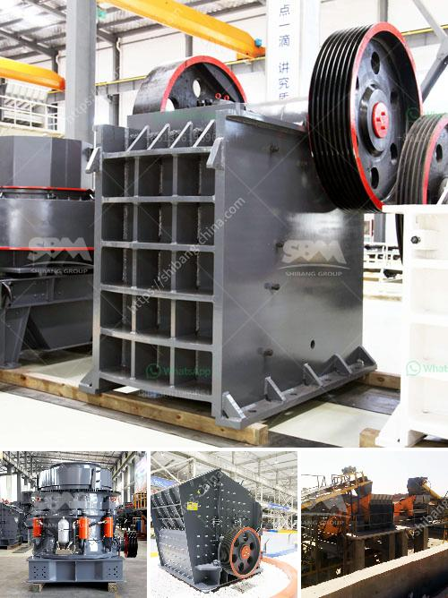

<h3>cone crusher manufacturers for sale in italy</h3>
Cone crusher is a widely used crusher machine in mining industry. Cone crusher has the advantages of high crushing ratio, higher working efficiency, lower energy consumption, and uniform product size, which is suitable for medium and fine crushing of various ores and rocks.

Cone crushers are a type of compression crusher used by aggregate, coal, concrete, crushing, fracking sand, and mining industries. This type of crusher features a concave surface and a conical head, both of which are typically lined with manganese steel liners. The inner cone has a slight circular movement, but does not rotate; the movement is generated by an eccentric arrangement.

Italy has a strong industrial base for the manufacturing of cone crushers. Along with the country's strong exports in machinery and equipment, Italy is well known for its strong manufacturing industry, which includes cone crusher manufacturers for sale.

There are many cone crusher manufacturers in Italy. SBM is a world-leading cone crusher supplier. With decades of experience in designing, manufacturing and servicing crushers, SBM has been a significant player in the crusher market, both nationally and internationally.

The company's cone crusher range includes several models such as HPT cone crusher, HST cone crusher, HP hydraulic cone crusher, and S series cone crusher. Each model is designed to crush different materials and have different capacities. In addition, SBM cone crushers are ideal for secondary and tertiary crushing stages in both stationary and mobile applications.

Other notable cone crusher manufacturers include Metso, Joyal, and McCloskey. These companies are known for their commitment to innovation and quality products. These manufacturers also offer extensive customer support and service options to ensure optimal crusher performance and minimize downtime.

Italy's cone crusher market is highly competitive and dominated by a few major players. In terms of market share, the top five manufacturers account for more than 50% of the total market. However, smaller manufacturers are also present in the market and cater to specific customer requirements.

In recent years, the demand for cone crushers in Italy has been growing steadily due to the country's growing construction and infrastructure projects. Additionally, the mining industry is also driving the demand for cone crushers as it enhances productivity and efficiency in ore crushing operations.

When purchasing a cone crusher, it is essential to consider factors such as capacity requirements, feed size, and the specific application. It is advisable to consult with a knowledgeable sales representative from a reputable cone crusher manufacturer to ensure that the right crusher is selected for the job.

In conclusion, cone crusher manufacturers in Italy offer a variety of models to suit different customer needs. These manufacturers are known for their durability, reliability, and outstanding performance. With the increasing demand for cone crushers, Italy presents promising opportunities for cone crusher manufacturers.
<h3>Contact us</h3><ul><li><strong>Whatsapp:&nbsp;<a href="https://wa.me/8613661969651">+8613661969651</a></strong></li><li><a href="https://swt.shibang-china.com/?git&amp;zhl&amp;cone crusher manufacturers for sale in italy"><strong>Online Service(chat now)</strong></a></li></ul><h3>Related</h3><ul><li><a href='cement clinker ball mill.md'>cement clinker ball mill</a></li><li><a href='stone quarries in mpumalanga.md'>stone quarries in mpumalanga</a></li><li><a href='crusher equipment in sweden.md'>crusher equipment in sweden</a></li><li><a href='stone crushing plant manufacturer.md'>stone crushing plant manufacturer</a></li><li><a href='how to start a stone crushing company in canada.md'>how to start a stone crushing company in canada</a></li></ul>