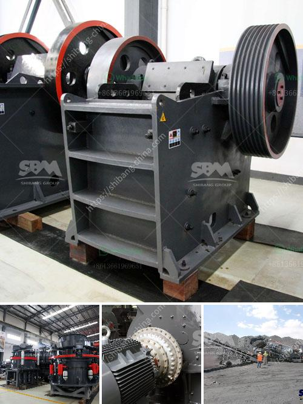

<h3>cone crusher mobile uk</h3>
The Cone Crusher Mobile UK is a revolutionary piece of machinery, offering the ability to effectively process and crush materials on the move. This mobile cone crusher is designed for versatility and ease of use, ensuring efficient results every time.

One of the key benefits of the Cone Crusher Mobile UK is its ability to crush materials directly at the site, eliminating the need for transportation and reducing costs. This is particularly advantageous for construction sites and mining operations where materials need to be processed on-site. With this mobile crusher, materials can be crushed and processed immediately, saving time and resources.

Another great feature of the Cone Crusher Mobile UK is its compact design and easy maneuverability. This crusher can be easily transported to different job sites, making it ideal for a wide range of applications. Its small size and lightweight construction ensure that it can be easily moved and set up, even in tight spaces. Whether it is a remote construction site or a mining operation in a difficult terrain, this mobile crusher can be easily transported and set up without any hassle.

Furthermore, the Cone Crusher Mobile UK offers exceptional performance and productivity. Its powerful crushing capabilities allow it to handle a wide range of materials, from hard rock to recycled concrete. The innovative design and high-quality components ensure that this crusher delivers maximum performance, even in the toughest conditions. With its high crushing capacity and efficient operation, this mobile crusher is a reliable solution for any crushing application.

In addition to its impressive performance, the Cone Crusher Mobile UK also offers convenience and ease of maintenance. This crusher is equipped with several features that facilitate easy maintenance and quick servicing. The accessibility of key components and the simple design of the crusher make it easy to inspect, clean, and perform routine maintenance tasks. This ensures that the crusher remains in optimal condition, delivering consistent results over time.

Overall, the Cone Crusher Mobile UK is a game-changer in the field of mobile crushing. Its versatility, compact design, and exceptional performance make it an ideal choice for a wide range of applications. Whether it is for construction, mining, or recycling, this mobile crusher offers efficient and reliable crushing capabilities. With its ability to crush materials on-site, transportability, and ease of maintenance, the Cone Crusher Mobile UK is revolutionizing the way materials are processed and crushed.
<h3>Contact us</h3><ul><li><strong>Whatsapp:&nbsp;<a href="https://wa.me/8613661969651">+8613661969651</a></strong></li><li><a href="https://swt.shibang-china.com/?git&amp;zhl&amp;cone crusher mobile uk"><strong>Online Service(chat now)</strong></a></li></ul><h3>Related</h3><ul><li><a href='iron ore processing plant design pdf.md'>iron ore processing plant design pdf</a></li><li><a href='dolomite processing plant in mexico.md'>dolomite processing plant in mexico</a></li><li><a href='mobile crusher morocco price.md'>mobile crusher morocco price</a></li><li><a href='feldpar powder mill manufature.md'>feldpar powder mill manufature</a></li><li><a href='stone crusher second.md'>stone crusher second</a></li></ul>