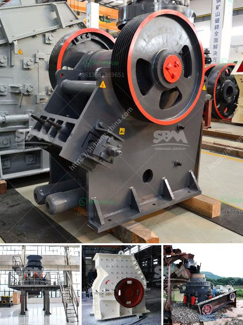

<h3>cone crushers for sale</h3>
Cone crushers are a type of compression crusher used by aggregate, coal, concrete, crushing, fracking sand, and mining industries. This type of machine utilizes a mantle and a concave to crush and squeeze the material into smaller pieces.

Cone crushers come in different sizes depending on the desired output and production capacity. These machines work by reducing the material size between an eccentrically rotating mantle and a concave bowl liner. As the rock enters the top of the cone crusher, it gets squeezed between the mantle and the concave liner, becoming smaller and smaller until it is discharged at the bottom.

One of the significant advantages of cone crushers is their ability to produce a well-graded cubic-shaped end product. This feature makes them ideal for secondary and tertiary crushing applications where the end product quality is crucial. Cone crushers can efficiently produce different types of materials, such as aggregates and sand, by adjusting the crusher's stroke and cavity.

When looking for cone crushers for sale, there are several factors to consider. The first and foremost is the machine's size and production capacity. Depending on your output requirements, you need to find a cone crusher that can handle the desired material volume efficiently. Additionally, it is essential to consider the crusher's power and performance capabilities to ensure that it meets your specific needs.

Another crucial factor to consider is the maintenance and operating costs associated with the cone crusher. Look for a machine that is easy to maintain and requires minimal downtime for servicing. Opt for cone crushers that come with user-friendly control panels and monitoring systems to facilitate smooth operation and prevent costly breakdowns.

Furthermore, it is vital to purchase cone crushers from reliable and reputable manufacturers or dealers. This ensures that you are getting a high-quality machine that is built to last. Reputable sellers often provide detailed product descriptions, specifications, and warranty information, helping you make an informed decision about your purchase.

It is also worth mentioning that cone crushers can be stationary or portable, depending on your project requirements. Stationary cone crushers are permanently mounted and are commonly used in mining and aggregate industries. Portable cone crushers, on the other hand, can be easily transported from one site to another, making them ideal for construction and recycling projects.

In conclusion, cone crushers are powerful machines that are widely used in various industries for crushing and squeezing materials into smaller pieces. When looking for cone crushers for sale, it is essential to consider factors such as size, production capacity, maintenance costs, and reputable sellers. By conducting thorough research and comparing different options, you can find the right cone crusher that meets your specific needs and provides high-quality end products.
<h3>Contact us</h3><ul><li><strong>Whatsapp:&nbsp;<a href="https://wa.me/8613661969651">+8613661969651</a></strong></li><li><a href="https://swt.shibang-china.com/?git&amp;zhl&amp;cone crushers for sale"><strong>Online Service(chat now)</strong></a></li></ul><h3>Related</h3><ul><li><a href='used stone crusher machine for sale in uae.md'>used stone crusher machine for sale in uae</a></li><li><a href='quartz mining process in andhra pradesh types prices.md'>quartz mining process in andhra pradesh types prices</a></li><li><a href='mobile crushing plant 10x36 cost.md'>mobile crushing plant 10x36 cost</a></li><li><a href='coal mining machines in south africa.md'>coal mining machines in south africa</a></li><li><a href='hard rock crushers manufacturers india.md'>hard rock crushers manufacturers india</a></li></ul>