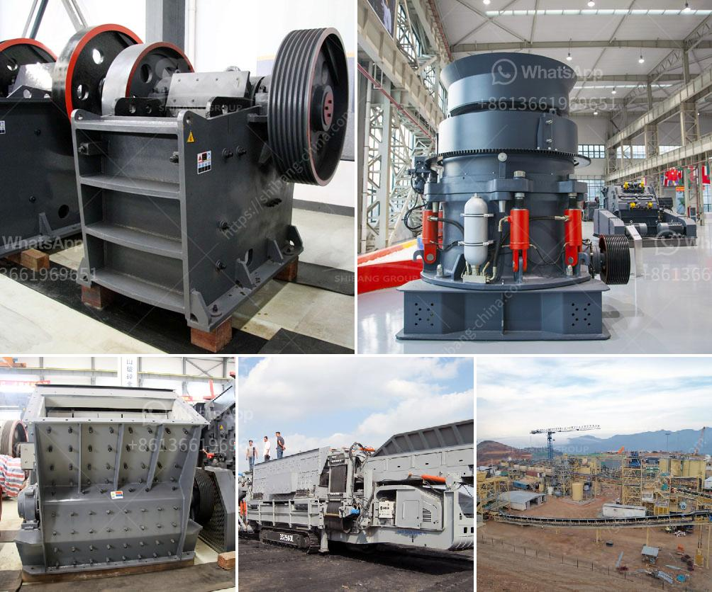

<h3>consol glass cullet price per ton south africa</h3>
South Africa is known for its vibrant glass manufacturing industry, with Consol Glass leading the pack as the country's largest glass packaging manufacturer. The company has been at the forefront of sustainable practices, including the use of cullet, or recycled glass, in its manufacturing process.

Cullet plays a crucial role in the glass manufacturing industry as it reduces the need for raw materials, such as sand, soda ash, and limestone. By utilizing cullet, glass manufacturers can significantly decrease their carbon footprint and overall environmental impact. Consol Glass, in particular, aims to be environmentally responsible and aims to minimize raw material usage.

One of the key factors influencing the use of cullet is its price per ton. The cost of cullet can vary based on market conditions, supply and demand, and other factors. In South Africa, Consol Glass has been a major advocate for using cullet, and the company has consistently been collecting glass bottles through its widespread recycling programs.

The price of cullet per ton in South Africa can range from ZAR 200 to ZAR 500 (approximately USD 14 to USD 35). Several factors can influence the price, such as the quality of the cullet, the source of the cullet (industrial or post-consumer waste), and the operational costs associated with recycling and processing.

Consol Glass has put in substantial efforts to optimize its cullet supply chain and enhance the quality of the recycled glass. This has contributed to the steady supply of quality cullet, making it an attractive choice for glass manufacturers in South Africa. The consistent availability of cullet has also helped stabilize the price per ton.

Glass manufacturers, including Consol Glass, have recognized the economic and environmental benefits of using cullet. By using recycled glass, these companies save on production costs by reducing raw material expenses. Additionally, the use of cullet reduces energy consumption and greenhouse gas emissions associated with glass production.

The South African government has also recognized the importance of sustainable practices and driving the circular economy. It has implemented various measures to encourage recycling and the use of cullet, which further strengthens the cullet market. These measures include financial incentives and regulations that require businesses to meet certain recycling targets.

However, challenges still exist in increasing the adoption of cullet in glass manufacturing. Contamination and inconsistent supply are common issues that need to be addressed. Consol Glass, along with other stakeholders, is working to develop strategies to improve the quality and purity of cullet.

In conclusion, cullet plays a vital role in the glass manufacturing industry in South Africa, contributing to both economic and environmental sustainability. The price of cullet per ton varies based on several factors such as quality, source, and operational costs. Consol Glass has been a key player in promoting the use of cullet, and its efforts have helped stabilize the price of cullet in the market. With the support of the government and continuous improvements in recycling processes, the use of cullet is expected to further grow in South Africa's glass manufacturing industry.
<h3>Contact us</h3><ul><li><strong>Whatsapp:&nbsp;<a href="https://wa.me/8613661969651">+8613661969651</a></strong></li><li><a href="https://swt.shibang-china.com/?git&amp;zhl&amp;consol glass cullet price per ton south africa"><strong>Online Service(chat now)</strong></a></li></ul><h3>Related</h3><ul><li><a href='rock crusher saudi arabia.md'>rock crusher saudi arabia</a></li><li><a href='stone crusher plant price.md'>stone crusher plant price</a></li><li><a href='cost of conveyor belt system for coal loading.md'>cost of conveyor belt system for coal loading</a></li><li><a href='nepal crushing crusher.md'>nepal crushing crusher</a></li><li><a href='raymond grinding mill germany.md'>raymond grinding mill germany</a></li></ul>